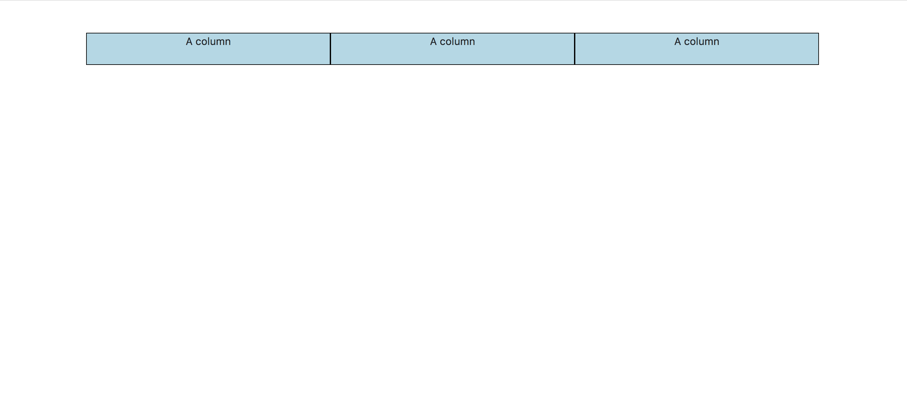
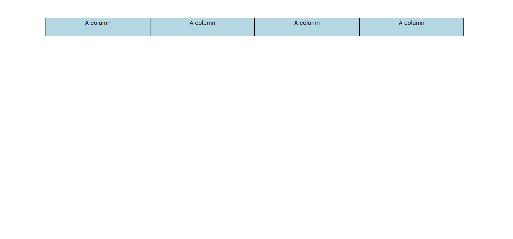
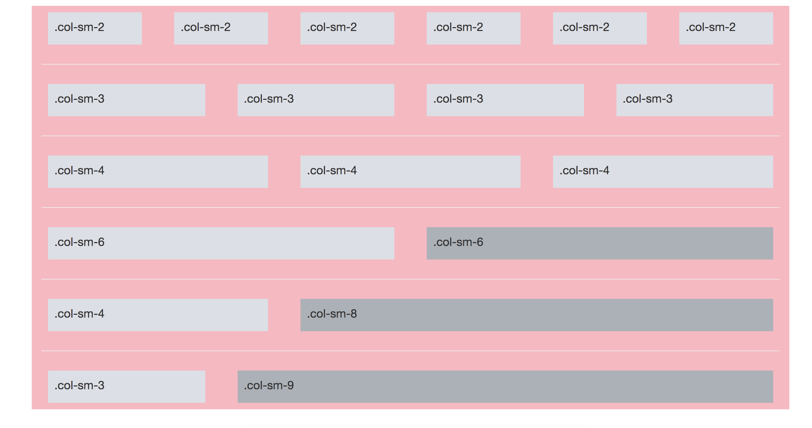
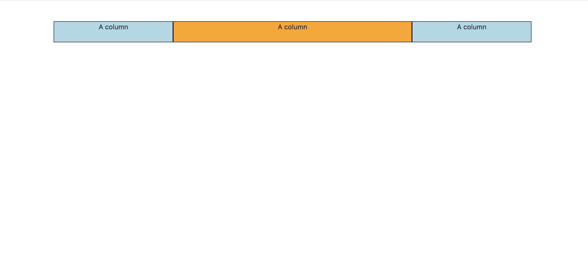
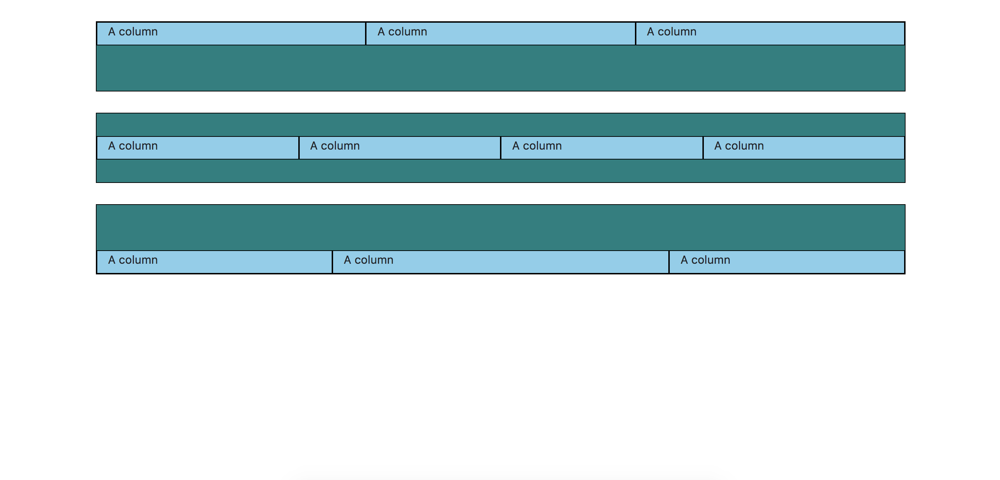

# The Grid (Bootstrap II)

### Lesson Objectives
- Learn, and master the grid

## Intro

Great, so we've kinda learned some "typography" and some dropdowns.  While those are great to do in Bootstrap, the *real* power of this stuff lies in the grid system. 

> "Bootstrap’s grid system uses a series of containers, rows, and columns to layout and align content. It’s built with flexbox and is fully responsive."

It makes what we're about to do possible.

## Example:

Create a new HTML and CSS page.  Copy and paste from the template we saved yesterday.

In the `<body>`...

```html
<div class="container">
  <div class="row">
    <div class="col-sm">
      A column
    </div>
    <div class="col-sm">
      A column
    </div>
    <div class="col-sm">
      A column
    </div>
  </div>
</div>
```

In your `styles.css`...

```css
body{
	text-align: center;
}

div{
	height: 50px;
}

div.container{
	margin-top: 50px;
}

div.col-sm{
	border: 1px solid black;
	background-color: lightblue;
}

```

You're going to see something like...



Interesting...

What if we add another `col-sm`.

```html
<div class="container">
  <div class="row">
    <div class="col-sm">
      A column
    </div>
    <div class="col-sm">
      A column
    </div>
    <div class="col-sm">
      A column
    </div>
    <div class="col-sm">
      A column
    </div>
  </div>
</div>
```

This translates to...



<b>NOTE</b> how the columns are automatically resizing?  Thank Flexbox for that.

*Note 2: All the columns are within a div with class 'row'.  'Row' pretty much means new line*


### Exercise

Add a 5th column, then a 6th column.

Give the 5th column it's own separate background color.  What might we have to do?

*Hint: Think about the thing you need to swipe into school every day*

## Great, but why does this work the way it works?

>Containers provide a means to center and horizontally pad your site’s contents. Use .container for a responsive pixel width or .container-fluid for width: 100% across all viewport and device sizes.

> Rows are wrappers for columns. Each column has horizontal padding (called a gutter) for controlling the space between them. This padding is then counteracted on the rows with negative margins. This way, all the content in your columns is visually aligned down the left side.

> In a grid layout, content must be placed within columns and only columns may be immediate children of rows.

> Thanks to flexbox, grid columns without a specified width will automatically layout as equal width columns. For example, four instances of .col-sm will each automatically be 25% wide from the small breakpoint and up. See the auto-layout columns section for more examples.

> Column classes indicate the number of columns you’d like to use out of the possible 12 per row. So, if you want three equal-width columns across, you can use .col-4.

Below is a simplified diagram of what I'm talking about.



## Column Sizes.

Generally, when working on a desktop web version of your site, the column sizes don't particularly matter.  However, when you're looking on your cell phone or tablet, then the type of column you choose becomes important.

This is how it's generally broken down.

|  			 | Extra Small | Small | Medium | Large | Extra Large |
| ------ | ----------- | ------| ------ | ----- | -----------
| Max Width | auto |    540px |    720px | 960px | 1140px
| class prefix | .col- | .col-sm- | .col-md- | .col-lg- | .col-xl-
| max columns  |  12	| 12 | 12 | 12 | 12																			 

## Utilizing different sizes.

While remembering that the grid is 12 units wide, what if I want a middle column to be bigger than the ends?

### Exercise

Try to make this picture come to life:



*Hint: ```.col-x```, where x is how many units wide you want the column to be*

## Grid + Flexbox

You can put your columns wherever you want to!  This is courtesy of flexbox.

Check this out:

```html
<div class="container">
  <div class="row align-items-start" id="row">
    <div class="col">
      A column
    </div>
    <div class="col">
      A column
    </div>
    <div class="col">
      A column
    </div>
  </div>
  <div class="row align-items-center" id="row">
    <div class="col">
      A column
    </div>
    <div class="col">
      A column
    </div>
    <div class="col">
      A column
    </div>
    <div class="col">
      A column
    </div>
  </div>
  <div class="row align-items-end" id="row">
    <div class="col">
      A column
    </div>
    <div class="col-5">
      A column
    </div>
    <div class="col">
      A column
    </div>
  </div>
</div>
```

```css
div{
	height: 50px;
}
div#row{
	margin-top: 30px;
	border: 1px solid black;
	height: 99px;
	background-color: teal;
}
div.col, .col-5{
	border: 1px solid black;
	height: 33px;
	background-color: skyblue;
}
```

And this produces...



### Exercise

Replicate the below image.


Hints:
- `.col` height = `500px`
- you can set `id` alongside `class`

<h2><a href="https://www.w3schools.com/bootstrap4/bootstrap_grid_basic.asp">W3 Schools Grid Bootstrap</a></h2>
