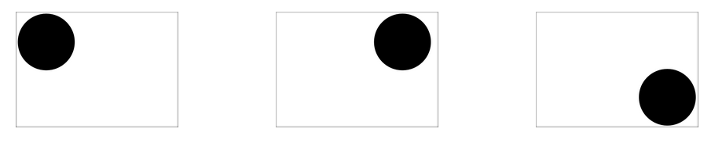

## Animate 2: Transition || Webkit

## Link to this lesson:
<h1><a href="http://bit.ly/2yvq1Ra">http://bit.ly/2yvq1Ra</a></h1>

### Do Now

- W5D5 folder with index.html and styles.css
- Create ONE `<div>` in the `<body>` that has these properties...

```html
<div id="box"></div>
```

```css
div#box{
  height: 100px;
  width: 100px;
  background-color: magenta;
  border: 1px solid black;
}
div#box:hover{
  background-color: cyan;
  width: 200px;
}
```
<hr>

### Transitions

A transition changes one or many attributes of an element’s style gradually.
```
transition: width 10s;
```
The above will define the time of a transition if the width property changes, for instance if the element has a different width on :hover

Transitions can also be broken out into their component properties:
```
transition-property: background-color;
transition-duration: 1s;
transition-timing-function: linear;
transition-delay: 2s;
```

#### Transition-property

Defines the CSS property that a transition is applied to.
```
transition-property: width;
transition-property: background-color;

transition: <property> <duration> <timing-function> <delay>;
```
#### Transition-delay

Specifies how long until the transition starts
```
transition-delay: 2s;

transition: <property> <duration> <timing-function> <delay>;
```

#### Transition-duration
Specifies how long the transition will last
```
transition-duration: 2s;

transition: <property> <duration> <timing-function> <delay>;
```

#### Transition-timing-function

Specifies which “timing function” or “easing” will be used for the transition.
Possible values include ease, linear, ease-in, ease-out, ease-in-out, and cubic-bezier to define custom functions.

```
transition-timing-function: cubic-bezier(0,0,0.58, 1);
transition: <property> <duration> <timing-function> <delay>;
```

<a href="https://www.w3schools.com/cssref/css3_pr_transition-timing-function.asp">List of timing functions here!</a>

### EASINGS.NET

Check out easings.net for more examples of easing functions

### Examples

In your HTML, all you need is...

```
<body>
  <div id="box">
    <p>Hello!</p>
  </div>
</body>
```

#### ELEMENT HEIGHT

```
div#box{
  background-color: orange;
  width: 200px;
  height: 100px;
}
div#box:hover{
  width: 200px;
  height: 300px;
}
div#box{
  transition: 10s height;
}
```

#### BACKGROUND COLOR AND LINEAR EASING
```
div#box{
  background-color: #CCCC33;
  width: 200px;
  height: 100px;
}
div#box:hover{
  width: 400px;
  height: 100px;
  background-color: #0E0EFF;
}
div#box{
  transition: background-color 4s linear;
}
```

#### BACKGROUND COLOR + WIDTH (notice how we can set multiple properties to transition, but we need to separate them via commas)

```
div#box{
  background-color: #CCCC33;
  width: 200px;
  height: 100px;
}
div#box:hover{
  width: 400px;
  height: 100px;
  background-color: #0E0EFF;
}
div#box{
  transition: background-color 4s linear, width 4s;
}
```
The above will set up transitions for the width property and the background-color property. linear is the type of easing, or “timing function” that will be used.

#### EXERCISE
Try building different CSS transitions on 3 different elements. Try animating the following properties:

```
background
width
padding
margin
color
```

### CSS-3 Animations

Remember when the web was covered in Macromedia Flash videos and games?
A similar effect can now be achieved with straight CSS using CSS3 animations.
These allow the use of keyframes to define the breakpoints of an animation

#### Keyframes

A keyframe is a moment that defines the starting and ending points of a smooth transition
For instance, if an object was moving to the right and to the bottom of the screen in an animation, you’d might have the following keyframes:



The way CSS-3 animations work: you define an animation by defining keyframes based on percentages
For instance, if your animation has a keyframe at 50% and is 6 seconds long, the animation will reach that keyframe at the 3 second mark
For animations, you may want to use a vendor prefix (-webkit-)

```
@keyframes some-keyframe {
  0% {margin-left: 0px; margin-top: 0px;}
  25% {margin-left: 100px; margin-top: 150px;}
  50% {margin-left: 250px; margin-top: 150px;}
  100% {margin-left: 350px; margin-top: 200px;}
}
```

#### Calling the animation

Now that you’ve defined keyframes for your animation, you have to call the animation on an element and define a few more options for the animation itself

#### Animation properties
```
#box{
  /*The name of your defined animation (after @keyframes)*/

  -webkit-animation-name: some-keyframe;

  /*How long the animation will run*/

  -webkit-animation-duration: 5s;

  /*Which easing/timing function to use */

  -webkit-animation-timing-function: linear;

  /*How long to wait before starting the animation*/

  -webkit-animation-delay: 2s;

  /*how many times to run it (can be infinite)*/

  -webkit-animation-iteration-count: 2;

  /*should animation play in reverse on alternate runs */

  -webkit-animation-direction: alternate;

  /*should the animation start of running or paused */

  -webkit-animation-play-state: running;
}
```

#### Example!

```
div#box{
  height: 200px;
  width: 200px;
  border-radius: 50%;
  background-color: teal;
  border: 10px double yellow;
}

div#box{
  -webkit-animation-name: roll;
  -webkit-animation-duration: 7s;
  -webkit-animation-timing-function: linear;
  -webkit-animation-fill-mode: forwards;
}

@keyframes roll {
  0% {
    margin-left: 0px;
    margin-top: 0px;
  }
  100% {
    margin-left: 400px; 
    margin-top: 450px;
  }
}
```

#### Exercise
Try constructing the animation illustrated on the Keyframes slide! Your element doesn’t necessarily have to be circular, but it should travel to the right and then the bottom of the screen.


#### YOU CAN DO SOME PRETTY CRAZY COOL THINGS WITH CSS3 ANIMATIONS.

CSS Solar System: 
http://codepen.io/juliangarnier/pen/idhuG <br>

CSS Spy Drone: 
http://codepen.io/bertanyaman/pen/YWGLJK <br>

Original Hover Effects: 
http://tympanus.net/Tutorials/OriginalHoverEffects/

