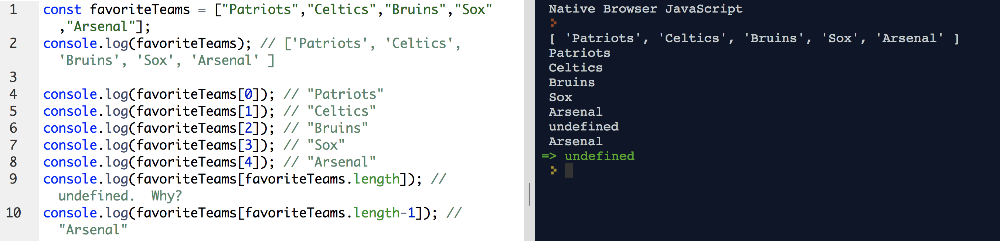
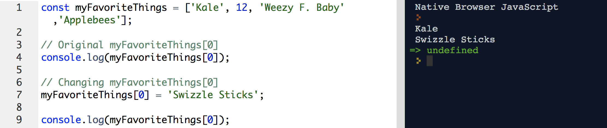
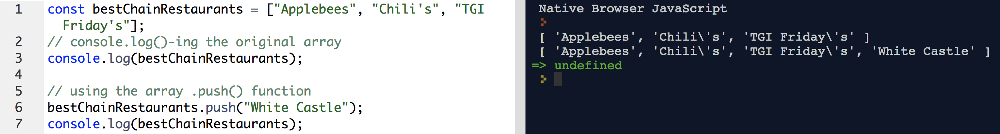
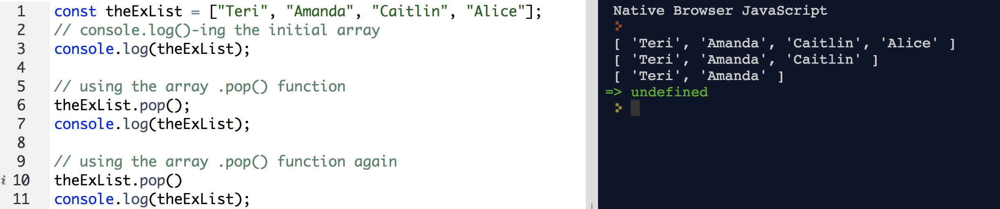
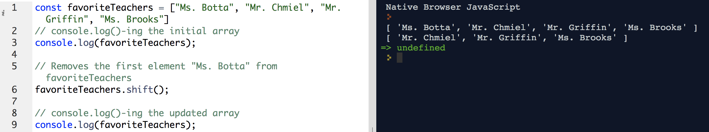
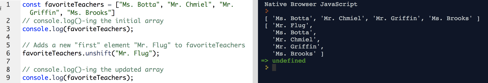

# Arrays

### Lesson Objectives
- Learn the array data type

## Arrays

An array is a type of data-type that holds an ordered list of values, of any type:

```js
const arrayName = [element0, element1, ...];
```

Ex.

```js
const favoriteTeams = ["Patriots", "Celtics", "Bruins", "Sox", "Arsenal"];
console.log(favoriteTeams); // ['Patriots', 'Celtics', 'Bruins', 'Sox', 'Arsenal' ]
```

You use bracket notation to grab an item in an array:  Bracket notation is the variable name with an index.  

```js
arrayName[0] // grabs the first item in the array
arrayName[1] // grabs the second item in the array
arrayName[arrayName.length] // grabs the "last" item in the array.  This doesn't work, however.  
arrayName[arrayName.length - 1] // this works
```

ex. 
```js
const favoriteTeams = ["Patriots","Celtics","Bruins","Sox","Arsenal"];
console.log(favoriteTeams); // ['Patriots', 'Celtics', 'Bruins', 'Sox', 'Arsenal' ]

console.log(favoriteTeams[0]); // "Patriots"
console.log(favoriteTeams[1]); // "Celtics"
console.log(favoriteTeams[2]); // "Bruins"
console.log(favoriteTeams[3]); // "Sox"
console.log(favoriteTeams[4]); // "Arsenal"
console.log(favoriteTeams[favoriteTeams.length]); // undefined.  Why?
console.log(favoriteTeams[favoriteTeams.length-1]); // "Arsenal"
```



Yes, arrays use `const` - even though you can update the stuff inside them, it's still the same array!

```js
const rainbowColors = ['Red', 'Orange', 'Yellow', 'Green', 'Blue', 'Indigo', 'Violet'];
const faveNumbers = [12, 15, 20];
const myFavoriteThings = ['Kale', 12, 'Weezy F. Baby','Applebees'];
```

### Exercise

- I want you to use bracket notation to grab the following items within the above arrays, and `console.log()` them.

1. "Yellow"
2. 20
3. Broccoli

<hr>

## Manipulating Arrays

You can also use bracket notation to change the item in an array:

```js
const myFavoriteThings = ['Kale', 12, 'Weezy F. Baby','Applebees'];

// Original myFavoriteThings[0]
console.log(myFavoriteThings[0]); // "Kale"

// Changing myFavoriteThings[0]
myFavoriteThings[0] = 'Swizzle Sticks';

console.log(myFavoriteThings[0]); // "Swizzle Sticks"
```



### Exercise

- Change the second item in the array
- Change the last item in the array.  Assume that I'm blind and I have no idea how many items are actually in the array.

<hr>

## Adding to the array

Arrays are a known data type in JS.  They have their own built in functions as well. 

<h2>.push()</h2>

The array `.push()` method adds an item to the END of the array.

```js
const bestChainRestaurants = ["Applebees", "Chili's", "TGI Friday's"];

// using the array .push() function
bestChainRestaurants.push("White Castle");
console.log(bestChainRestaurants);
```



### Exercise

Use the `.push()` method to add something else to the array. 

<hr>

## Removing from the array.

<h2>.pop()</h2>

The array `.pop()` method removes the last item of the array.  

```js
const theExList = ["Teri", "Amanda", "Caitlin", "Alice"];
// console.log()-ing the initial array
console.log(theExList);

// using the array .pop() function
theExList.pop();
console.log(theExList);

// using the array .pop() function again
theExList.pop()
console.log(theExList);
```



## Bonus methods

So far, we've been adding/removing to the END of the array.  What if we want to add/remove from the beginning?

<h2>.shift()</h2>

The `shift()` method removes the first array element and "shifts" all other elements to a lower index.

```js
const favoriteTeachers = ["Ms. Botta", "Mr. Chmiel", "Mr. Griffin", "Ms. Brooks"]
// console.log()-ing the initial array
console.log(favoriteTeachers);

// Removes the first element "Ms. Botta" from favoriteTeachers
favoriteTeachers.shift();  

// console.log()-ing the updated array
console.log(favoriteTeachers);
```



<h2>.unshift()</h2>

The `unshift()` method adds a new element to an array (at the beginning), and "unshifts" older elements (pushes them down the line):

```js
const favoriteTeachers = ["Ms. Botta", "Mr. Chmiel", "Mr. Griffin", "Ms. Brooks"]
// console.log()-ing the initial array
console.log(favoriteTeachers);

// Adds a new "first" element "Mr. Flug" to favoriteTeachers
favoriteTeachers.unshift("Mr. Flug");  

// console.log()-ing the updated array
console.log(favoriteTeachers);
```

