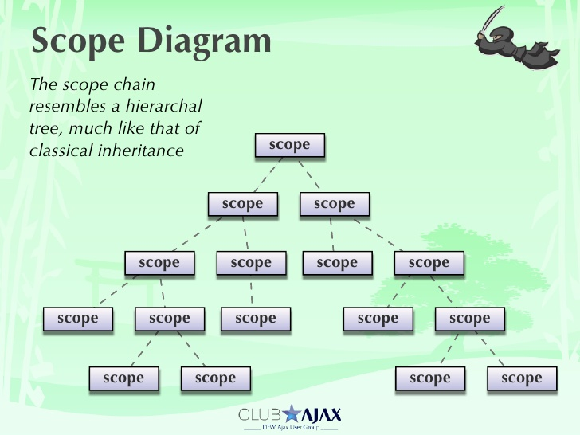
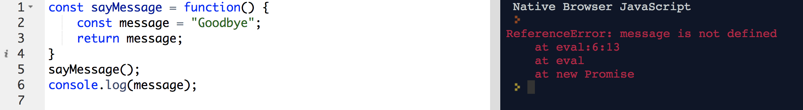
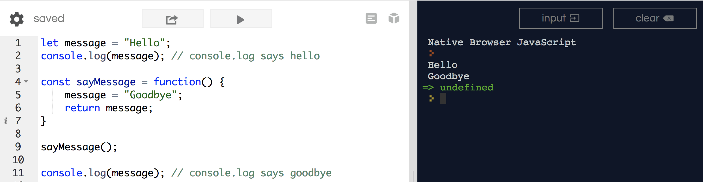
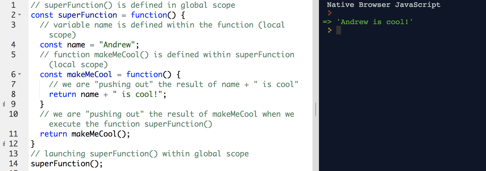

# Scope

### Learning Objectives

- Explain what scope is
- Discuss global and local scope
- Discuss the difference between public and private scope

### Why This is Important

- JavaScript has a number of unique characteristics regarding scope that can often times lead to frustration or confusion without a proper understanding.
- If you can master scope, you can master JavaScript
- Understanding scope is essential to understanding and dictating how variables interact with the rest of your code.
- Can't stay DRY (Don't Repeat Yourself) without functions. Functions are first class objects in JS aka, they create scope.

### How We Will Learn This

- Discuss scope and diagram examples
- See scope first hand with our code

## Scope

Scope refers to the context of your code. They can be global or local.

Functions are first class objects in JavaScript. Each function creates its own scope!

Diagram scope using global circle. Inside can access outside, but outside can't access inside.



### Global Scope

- Think of global scope as the all encompassing environment in which the instance of JavaScript is running.
- Variables that get declared outside a function have Global Scope.

### Local Scope / Function scope

- Local scope refers to any scope that is defined right past the global one. If you define a function, this function will have its own scope inside the body of the function. Any function defined inside another function has a also a local scope and can refer to the parent scope, but this logic doesn't work the other way around.

Recap:
- Variables declared inside a function are local to that scope. They can only be accessed inside the function.
- JavaScript only creates new scopes with functions. Loops & conditionals for instance do not create new scope.


```js
// sayMessage() is declared in Global scope.
const sayMessage = function() {
    // variable message declared in local scope.
    const message = "Goodbye";
    return message;
}
sayMessage();
console.log(message);
```
<br>



Note that referring to `message` brings up an undefined error. The variable `message`...
1. Was never set in global scope, so it doesn't exist in global scope.
2. Was created inside the `sayMessage` function. So you can refer to it inside that function/local scope.
3. Inside can read outside but outside cannot read inside.

<hr>

However, if we have something like this...

```js
let message = "Hello";
console.log(message); // console.log says hello
const sayMessage = function() {
    message = "Goodbye";
    return message;
}
sayMessage();
console.log(message); // console.log says goodbye
```

Notice how we define variable `message` in Global scope.  What's the difference?



<hr>

Ok, let's look at the below code.  What's happening?  Try to process what's happening.

```js
// superFunction() is defined in global scope
const superFunction = function() {
  // variable name is defined within the function (local scope)
  const name = "Andrew";
  // function makeMeCool() is defined within superFunction (local scope)
  const makeMeCool = function() {
    // we are "pushing out" the result of name + " is cool"
    return name + " is cool!";
  }
  // we are "pushing out" the result of makeMeCool when we execute the function superFunction()
  return makeMeCool();
}
// launching superFunction() within global scope
superFunction();
```

<br>



#### Another Demo

```js
// Global Scope
const a = "Hello";

// This function is defined in the global scope
function sayHello(name) {
  return a + ", " + name;
}

sayHello("Katherine");
```

```js
// Global Scope
const a = 1; 

// This function is defined in the global scope
function getScore () {
  const b = 2;
  const c = 3;

  // This function is defined in the local scope
  function add() {
  	return a + b + c;
  }
  return add();
}

getScore();  // 6
```

##### Exercise

```js
const name = "Andrew";
const scope1 = function() {
  const age = 7;
  const scope2 = function() {
    // Something something something
    const scope3 = function() {
      // Bla bla
    }
  }
}
```

- Can I access age in scope1?
- Can I access name in scope2?
- Can scope3 access age?
- Can I access age in global scope?


Diagram the scope for the following.  Show me how many levels there are.  In what order are these functions executing?

```js
const brand = "Chevy";
const car = function() {
  console.log("Car");
  const color = "Green";
  const suv = function() {
    console.log("SUV");
    const sedan = function() {
      console.log("Sedan");
    };
    sedan();
  };
  suv();
}
car();
```

### Don't Pollute Global Scope
- Gives users access to hack your browser
- Makes collaborative coding liable to break as others can accidentally manipulate external logic


##### const/let
Reminder: use const by default, use let if the variable will be redefined later in the JS.
const/let are keywords to instantiate a variable only in that scope.
- using const/let in global scope makes the variable accessible everywhere
- not using the keyword const/let: if the variable doesn't exit, it will create it.
	- if the variable already exists anywhere in the accessible scope (inside can access outside) it will use the outside one instead of creating a new one.
	- This is very bad as it can allow yourself or others to manipulate code outside it's intended functionality!

---