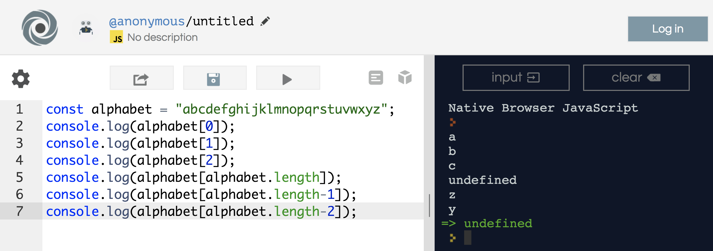

## Variables

<h1><a href="http://bit.ly/2gW45nE">http://bit.ly/2gW45nE</a></h1>

### Lesson Objectives
- Discuss what variables are
- Learn differing data types

### Do Now

<h2><a href="https://repl.it/languages/javascript" target="_blank">repl.it</a></h2>

Go to repl and write a couple `console.log()`s.  Remember the syntax?

```js
console.log("I like kit kats");
```

### Variables

Today, we are going to learn about variables. A variable is a line of code that stores some information for us. For example, if we want chocolate ice cream, then we look for the container labeled chocolate. The label tells us what is inside. Variables make coding easier because instead of remembering a bunch of numbers, we can remember names. There are three parts to every variable: a type, name, and value.

For example:

```js
const chocolate = "chocolate ice cream";
```

type: const
name: chocolate
value: "chocolate ice cream"

#### Examples

In repl, add three variables.

```js
const num = 5;
const name = "Katherine";
const catsAreCool = true;
```

I want you to console log these variables.  What do you see?

```js
console.log(num);
```

Note: do not use quotes when `console.log`-ing variables. 

### const vs let 

`const` is short for `constant`.  We'd use this variable type if we do not want the value to change at any point in the program.  

```js
const x = 5;
``` 

However, if we want this variable to change at some point during our program, could we use `const`?

```js
const x = 5;
x = 6;
console.log(x);
```

Run this code in repl.  What happens?

... 
... 

If we want the variable to change at some point, we'd use the variable type `let`.

```js
let x = 5;
x = 6;
console.log(x);
```

Does this work now?  Note: Remember the difference between `const` and `let`.  The differential between the two could be life or death.  Theoretically, you could use `let` for all things.  Consider `const` to be a safety valve - there are some variables that you won't want to change in your program, and using `const` will save you a lot of future headaches.

Rule of thumb: use `const` by default.  Only use `let` for special circumstances.

<hr>

### Primitive Data Types

In programming, data types are a critical concept.

Without data types, a computer cannot safely solve this:

```js
const x = "Andrew" + 27;
```

Does adding Andrew + 27 make any sense?  

JavaScript is smart enough to know what you're talking about.  JS will treat the above example like...

```js
const x = "Andrew" + "27";
```

Do you guys remember PEMDAS?  Please Excuse My Dear Aunt Sally.  This logic applies to JS as well.

#### Examples

```js
const a = 20 + 7 + "Andrew";
const b = "Andrew" + 20 + 7;
```

What happens when I `console.log` these variables?  

...

For `const a = 20 + 7 + "Andrew";`, JS recognizes that `20` and `7` are numbers, until "Andrew".  JS recognizes that "Andrew" is not a number, but rather a collection of letters.  

For `const b = "Andrew" + 20 + 7;`, JS recognizes that "Andrew" is a collection of letters.  Once that happens, it'll treat the rest of the phrase as a "collection of letters".  

Welcome, friends, to the realm of primitive data types.

<hr>

#### Strings

A string is a series of characters like "John Doe".  Strings are written using quotations. You can use single or double quotes.

```js
const greeting = "Hello, chaps";
const name = "Joan of Arc";
const restaurant = 'Sushi Nakazawa';
```

Note: if you need to use contractions in your string, use double quotes.

```js
const response = "You're doing alright, 'cool kid'";
const answer = "Everything's going to be okay, ol' chap";
```

#### Numbers

Numbers are... numbers.  Can be with or without decimals, positive or negative.

```js
const num1 = 40;
const num2 = 40.00;
```

#### Booleans

Booleans are used to determine true or false.  Think about conditional statements.

```js
const catsAreNice = false;
const dogsAreBetter = true;
const yankeesStink = true;
```

#### Undefined

A variable without a value is undefined.

```js
const yankees
```

I can also set a variable to equal undefined.

```js
let yankees;
yankees = undefined;
```

#### Recap

JS recognizes 4 major primitive data types:
- Strings
- Numbers
- Booleans
- Undefined

Note: if you need to double check what data type something is, you can use the `typeof` operator.

```js
const x = 5;
console.log(typeof x);

const blurb = "Hello, I am the best";
console.log(typeof blurb);
```

<hr>

### Strings (ctd)

A string holds an ordered list of characters:

```js
const alphabet = "abcdefghijklmnopqrstuvwxyz";
```

The length property reports the size of the string:
```js
console.log(alphabet.length); 
```

Each character has an index. The first character is always at index 0. The last character is always at index length-1.  Why is this the case?

```js
console.log(alphabet[0]); 
console.log(alphabet[1]); 
console.log(alphabet[2]); 
console.log(alphabet[alphabet.length]); 
console.log(alphabet[alphabet.length-1]); 
console.log(alphabet[alphabet.length-2]);  
``` 

Copy the code and what do you see?




