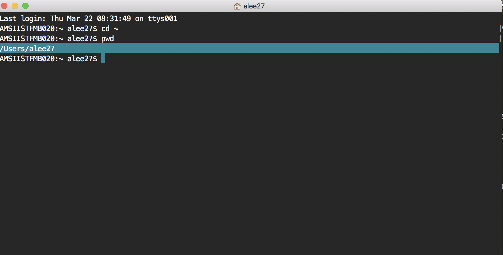

# Terminal Basics & Navigating the File System

### Learning Objectives
- Open apps and navigate your computer via terminal
- Summarize basic file system structure
- Explain the difference between relative and absolute pathing
- Open files using our text editor

##### Why this is important

Most users are accustomed to interacting with computers using GUI's (Graphical User Interfaces), however all computer interactions can be accessed through the command line/terminal. 

Many developers/tech people utilize the command line everyday to interact with applications efficiently and directly so it's essential to master the very basic terminal commands along with a sound grasp on basic file system.

##### How we will learn this

- Practice with CLI (Command Line Interface) commands
- Discuss pathing

### What is a shell?

Shell is simply a type of command line program, which contains a very simple, text-based user interface enabling us to access all of an operating system's services. It is, very simply, a program that accepts text as input and translates that text into the appropriate functions that you want your computer to run

### Terminal

- Launch the command prompt off terminal.
	- ⌘ (Command) + Space
	- "*Terminal"
	- `Enter`
- Since we'll be using terminal often, I strongly suggest you keep it locked in your dock.
	- Right click on the icon, highlight options, ensure the "Keep in Dock" is checked.

- When terminal launches, it will innately start off your computer's root directory (whatever the computer is named off of).

### What is root?

The *root directory* is the first or top-most directory in a hierarchy. It can be likened to the trunk of a tree, as the starting point where all branches originate from.



If you want to know if you're in your root directory, type...

`pwd`.  It should say `/users/` then your username.

If you need to navigate to your root directory...

`cd ~`  

### CLI Commands

- Check where you are on your command line
`pwd` : print working directory

- Let's open another tab inside our terminal
`⌘-T`

- Close current tab
`⌘-W`

- Let's execute a process from our terminal. Let's use the ping utility for example sake...

`ping 127.0.0.1`

```
Q: What is ping?
```

[What is ping?](https://en.wikipedia.org/wiki/Ping_(networking_utility))

-----

- Note that ping continues to run, we can stop the execution of a process off our current tab...
`Ctrl-C`

- Let's quit terminal
`⌘-Q`

-----

##### Best Friends
• `pwd` = "Print Working Directory"
• `cd` = "Change directory"
• `ls` = list contents of directory
• `ls -la` = Detailed list of contents
• `mkdir` = Create directory (Folder)
• `touch` = Create file

##### Exercise 

- Using just terminal and the command line, do the following.
- Feel free to use the reference below.

[CLI Cheatsheet](http://www.git-tower.com/blog/command-line-cheat-sheet/)

- Open Terminal
- `PWD` to confirm you're in your root
- If you're not in your root, `cd ~` to get there.
- Change directory to `/Desktop`
- Make a new directory on your desktop called `sample_directory`
- `cd` into that directory
- Make a new file called sample_text using the following command `touch sample_text.txt`
- Make another directory called `inside_folder`
- CD into the newly created `inside_folder`
- CD out of this folder up one level using `cd ../`
- CD up another level by using `cd ../` again
- Which directory are you now in? Confirm using `pwd`


### Pathing

Pathing refers to method in which files/folders are recognized within a file system structure.

### Absolute Pathing


### Relative Pathing

