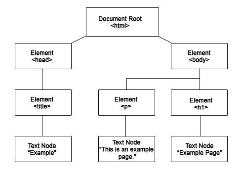
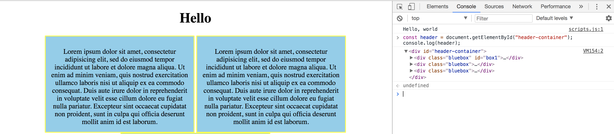
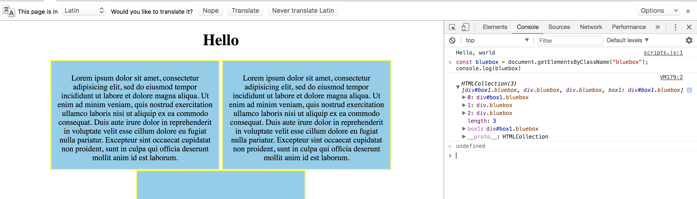

# DOM (I)

### Learning Objectives
- Describe the DOM
- Access elements in the DOM
- Add/remove elements to the DOM
- Edit existing elements in the DOM

### Why This Is Important

The DOM is an interface for our HTML and provides us with a structured representation of our document. With it, we can manipulate our HTML so our pages are no longer static data.

In other words, DOM and DOM manipulation is what allows websites to basically do anything "dynamic". 

Learning about the DOM and how it fits into the front end (visually what the user sees) also provides us a window into a bit more of how the internet works. This is obviously super important to our understanding of what we are learning and how it will fit into the entire web dev process as a whole.


### Okay, so what exactly is the Document Object Model?

- The Document Object Model (DOM) is an application programming interface (API) for HTML and XML documents. It defines the logical structure of documents and the way a document is accessed and manipulated.  It represents the page so that programs can change the document structure, style, and content. The DOM represents the document (document = "a Web Page") as nodes and objects. That way, programming languages can connect to the page.

- The best way to conceptualize DOM is as a "tree".  There is a "hierarchy" attached to this.



If you look at this diagram, and again below in HTML form...

```html
<!-- initial HTML tag  -->
<!DOCTYPE html> 
<html>

<!-- initial head tag  -->
<head> 
	<title>Sample Title</title>
</head> 
<!-- closing head tag  -->

<!-- initial body tag  -->
<body> 
	<h1>Example Page</h1>
	<p>This is an example page</p>
</body>
<!-- closing body tag  -->

</html> 
<!-- closing HTML tag  -->
```

1. An entire HTML page stems from the `<html>` tag.  
2. The `<head>` and `<body>` are the two major sections of a web page.
3. The `<title>` tag belongs inside of the `<head>` section.
4. The `<h1>` and `<p>` are enclosed inside of the `<body>` section.
5. The actual "text nodes" are enclosed inside of the `<title>`, `<h1>`, and `<p>` tags, respectively.

Basically, you'll start to see that the entire HTML language is built like a gigantic tree, with multiple branches and leaves.

DOM allows us to utilize this 'tree' to manipulate the entirety of the HTML on our page.

<hr>

### Steps

1. Save an `index.html`, `styles.css`, and `scripts.js` into a folder called "DOM 1".

2. Copy the following code into your `index.html` and `styles.css` respectively.

```html
<!DOCTYPE html>
<html>
<head>
	<title>A Title</title>
	<link rel="stylesheet" type="text/css" href="styles.css">
</head>
<body>
	<h1 id="first-h1">Hello</h1>  
	<div id="header-container">
		<div class="bluebox" id="box1">
			<p>Lorem ipsum dolor sit amet, consectetur adipisicing elit, sed do eiusmod
			tempor incididunt ut labore et dolore magna aliqua. Ut enim ad minim veniam,
			quis nostrud exercitation ullamco laboris nisi ut aliquip ex ea commodo
			consequat. Duis aute irure dolor in reprehenderit in voluptate velit esse
			cillum dolore eu fugiat nulla pariatur. Excepteur sint occaecat cupidatat non
			proident, sunt in culpa qui officia deserunt mollit anim id est laborum.</p>
		</div>
		<div class="bluebox">
			<p>Lorem ipsum dolor sit amet, consectetur adipisicing elit, sed do eiusmod
			tempor incididunt ut labore et dolore magna aliqua. Ut enim ad minim veniam,
			quis nostrud exercitation ullamco laboris nisi ut aliquip ex ea commodo
			consequat. Duis aute irure dolor in reprehenderit in voluptate velit esse
			cillum dolore eu fugiat nulla pariatur. Excepteur sint occaecat cupidatat non
			proident, sunt in culpa qui officia deserunt mollit anim id est laborum.</p>
		</div>
		<div class="bluebox">
			<p id="randomPara"></p>
		</div>
	</div>
	<script type="text/javascript" src="scripts.js"></script>
</body>
</html>
```

```css
body{
	text-align: center;
}
div.bluebox{
	background-color: skyblue;
	display: inline-block;
	height: 200px;
	width: 320px;
	border: 2px solid yellow;
	vertical-align: text-top;	
	padding: 10px;
}
```

In your JS, write a `console.log()`.  Why might you think we'd want to do this?

## Accessing/Manipulating Elements

If we press "Command-Option-I" in Chrome, we can retrieve, traverse, and manually edit specific elements inside of this DOM tree.  

### Searching the document

`document.getElementById()`

We can retrieve specific elements by grabbing them via a pre-existing ID assigned to the element.

```js
const header = document.getElementById('header-container');
console.log(header);
```



Notice that how, in the console, the `<div>` with the id of `header-container` returned in the `console.log()`.  We specifically cherry picked that `<div>`, and stored it inside of a variable.

#### Exercise

There's an ID in there for the "first h1".  Retrieve that inside of a variable, and `console.log()` it.

<hr>

`document.getElementsByClassName()`

We can retrieve groups of elements via utilizing their assigned class.

```js
const bluebox = document.getElementsByClassName("bluebox");
console.log(bluebox)
```


