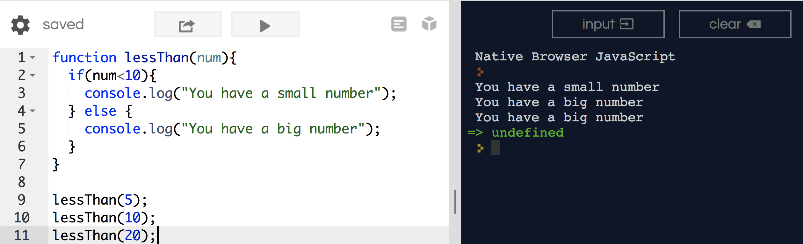
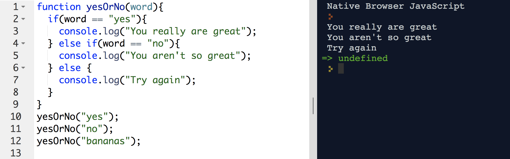
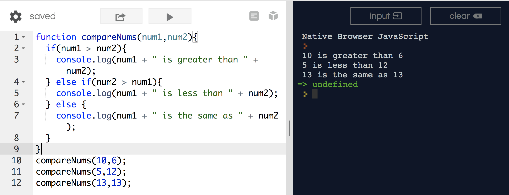
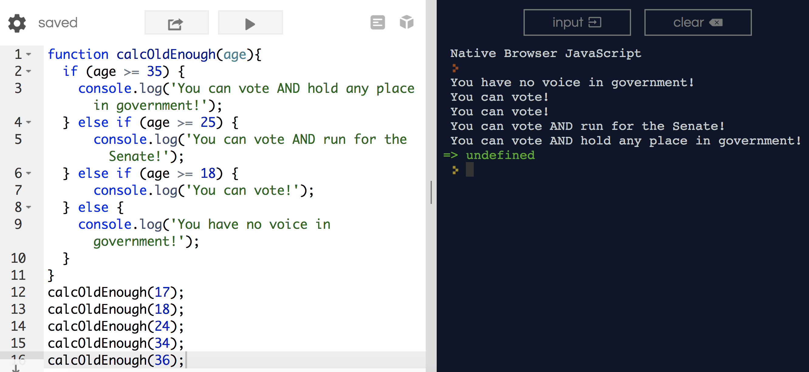

## Conditional Statements

### What are conditionals?

A conditional is a statement which executes if a certain ‘statement’ is true or false.  

So last week, I gave you your first taste of a conditional statement.  It looked like..

```js
if(condition){
	do something
} else {
	do something else
}
```

Some real life examples...

```js
if(becky scores a 100% on her test){
	she will receive a pony
}
```
```js
if(kelley types 100 words a minute){
	she is an all star typer
}
```
```js
if(gabrielle eats 1000 cheetos){
	her fingers will be disgustingly orange
}
```

Therefore, what the above examples are saying is - if a certain condition is true, then DO something (say something, execute something, etc..)

<hr>

What if the conditional is not met?

You might want to write a statement that takes into account when the condition is true, and then you might want to write a statement about when the condition is false/not met.

```js
if(becky scores a 100% on her test){
	she will receive a pony
} otherwise {
	she will receive a bag of coal
}
```

```js
if(gabrielle eats 1000 cheetos){
	her fingers will be disgustingly orange
} otherwise { 
	her fingers will be a little orange
}
```

<hr>
So, for a few real JS examples...

```js
function lessThan(num){
	if(num<10){
		console.log("You have a small number");
	} else {
		console.log("You have a big number");
	}
}

lessThan(5);
lessThan(10);
lessThan(20);
```

The above produces...



<hr>

I can also use strings as conditionals.

```js
function yesOrNo(word){
	if(word == "yes"){
		console.log("You really are great");
	} else if(word == "no"){
		console.log("You aren't so great");
	} else {
		console.log("Try again");
	}
}
yesOrNo("yes");
yesOrNo("no");
yesOrNo("bananas");
```

The above produces...



*Note: I can't use a single equals here.  That is not specific enough.  JavaScript needs to know how 'specific' you're being.  We'll get into this in a later lesson, but know that double-equals is a thing*

<hr>

I can also set up a "multi-conditional" statement.

```js
function compareNums(num1,num2){
	if(num1 > num2){
		console.log(num1 + " is greater than " + num2);
	} else if(num2 > num1){
		console.log(num1 + " is less than " + num2);
	} else {
		console.log(num1 + " is the same as " + num2);
	}
}

compareNums(10,6);
compareNums(5,12);
compareNums(13,13);
```

The above produces...



<hr>

Here is another example of a multi-conditional statement.

```js
function calcOldEnough(age){
	if (age >= 35) {
	  console.log('You can vote AND hold any place in government!');
	} else if (age >= 25) {
	    console.log('You can vote AND run for the Senate!');
	} else if (age >= 18) {
	    console.log('You can vote!');
	} else {
	  console.log('You have no voice in government!');
	}
}

calcOldEnough(17);
calcOldEnough(18);
calcOldEnough(24);
calcOldEnough(34);
calcOldEnough(36);
```

The above is..



`calcOldEnough(17);` --> `You have no voice in government!`.  Why?

<hr>

### Practice Problems

#### 1. What number's bigger?

Write a function named `greaterNum()` that:
- takes 2 arguments, both numbers.
- outputs whichever number is the greater (higher) number.

Call that function 2 times with different number pairs, and log the output to make sure it works (e.g. "The greater number of 5 and 10 is 10.").


#### 2. The Grade Assigner

Write a function named `assignGrade()` that:
- takes 1 argument, a number score.
- outputs a grade for the score, either "A", "B", "C", "D", or "F".

Call that function for a few different scores and log the result to make sure it works.

#### 3. The World Translator

Write a function named `helloWorld()` that:
- takes 1 argument, a language code (e.g. "es", "de", "en")
- outputs "Hello, World" for the given language, for at least 3 languages. It should default to returning English.

Call that function for each of the supported languages and log the result to make sure it works.