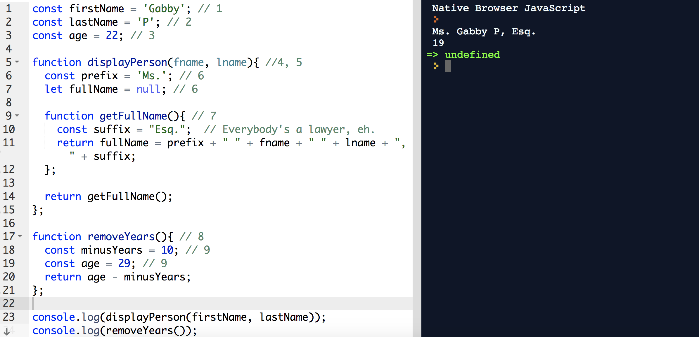

# Scope (cont)

## Building Scope

Let's see how scope works in a larger function. Here's the code we'll work with:

```js
const firstName = 'Gabby'; // 1
const lastName = 'P'; // 2
const age = 22; // 3

function displayPerson(fname, lname){ //4, 5
  const prefix = 'Ms'; // 6
  let fullName = null; // 6

  function getFullName(){ // 7
    const suffix = "Esq.";  // Everybody's a lawyer, eh.
    return fullName = prefix + " " + fname + " " + lname + " " + suffix;
  };

  return getFullName();
};

function removeYears(){ // 8
  const minusYears = 10; // 9
  const age = 49; // 9
  return age - minusYears;
};

console.log(displayPerson(firstName, lastName));
console.log(removeYears());
```

And all of this comes out to... 

<br>



<hr>

1. Found `const firstName` variable declaration.  
  - Put `firstName` variable in Global Scope.  
2. Found `const lastName` variable declaration.  
  - Put `lastName` in Global Scope.  
3. Found `const age` variable declaration.  
  - Put `age` in Global Scope.  
4. Found `const displayPerson` declaration.  
  - Put `age` in displayPerson in Global Scope.

  - Notice that `displayPerson`'s value is a function. So, create a inner scope and process this function.

5. Found the `firstName` and `lastName` declarations.

    *Note: function arguments behave just like local variables.  Put them in the `displayPerson` function scope.*

6. Found `prefix`, `fullName` variable declarations.  
  - Put them in the `displayPerson` function scope.  
7. Found `getFullName` declaration.  
  -Put `getFullName` in the displayPerson function scope.

  - Notice that `getFullName` is a function. So, create an inner scope and  process this function.
  - All done with `getFullName` function, no more variable declarations.
  - All done with `displayPerson` function, no more variable declarations.


8. Found `removeYears` variable declaration.
Put `removeYears` in Global scope.  

**Notice that `removeYears` value is a function. So, create a inner scope and process this function.**

9. Found `age` and `minusYears` variable declarations.  
Put these in the function's scope.


-----

### [BONUS] Additional Reading (More CS-y stuff)

Today's lecture covers a practical approach to scope. However, there's a lot more at play. To learn more about the nature of JavaScript at a lower level, feel free to read up on the following.

#### Compilation

The code that you write *must* first be translated into a form that the computer can understand.

Your source code should be _human readable_. However, this source code must then be translated into a set of 1's and 0's that a computer's CPU can understand.

The CPU is a chip on the computer that does all the processing. It's called the _Central Processing Unit_, or CPU.

`Source Code`  ==>  `1's and 0's`

Alternatively, the source code may be translated into a another type of language called _byte code_, which can be understood by a Virtual Machine (VM).

`Source Code` ==> `byte code`

#### Compiled Languages

Some languages are *explicitly* compiled. In other words, the programmer must run particular commands to invoke compilation.

For example, the **C** and **C++** languages are explicitly compiled. The programmer must run a command like:

`gcc -o hello_world -c hello_world.c`

This is done to translate the C code in the hello_world.c file into an *executable* or *binary* file that contains the 1's and 0's understood by the CPU.

*gcc* is a **C** compiler.

So here's what happens:

`Source Code`  ==>  `1's and 0's`

`hello_world.c`  ==>  `hello_world`

#### Interpreted Languages
Some languages don't require the programmer to explicitly run a compiler. **JavaScript**, **Java**, **Ruby** are a couple of these _interpreted languages_.

There is still compilation being done, but it's done automatically.

`Source Code` ==> `byte code`

#### From Source to Running Code.
There are two basic phases to go through when going from code in a file to a program running.

- **Compile Time** - a phase when the source code is translated to another form. For example, when we run a javascript program we will compile javascript to an intermediate language/byte code that the JavaScript Virtual Machine(VM) understands.

- **Runtime** - a phase when the computer actually runs each statement in the program.  For example, this is when the computer runs the javascript program byte code.

#### Variable Scope

The variable scope describes where in a program a variable can be seen. In other words, where it can be used. We'll see more later, but you've seen that variables declared within a function cannot be seen or used in the Global Scope.

#### Lexical Analysis

Part of the Compilation phase is _Lexical Analysis_. In general, Lexical Analysis scans through the source code, one character at a time, looking for language constructs like variables, functions, built-in keywords, etc.

It's during this time that the compiler builds variable scope and **declares** variables inside a variable scope.

Here's a quick summary of what your computer does when you're looking to run your JavaScript file:

  1. Read the Source Code in a JavaScript file into memory
  2. Compile the source code
    a. Lexical Analysis
    b. Build Scope
    c. Turn source code into a form understood by VM, byte code
  3. Execute byte code
