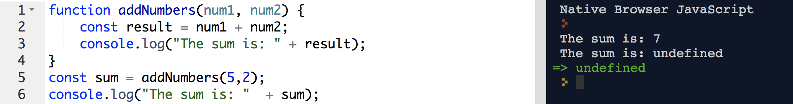
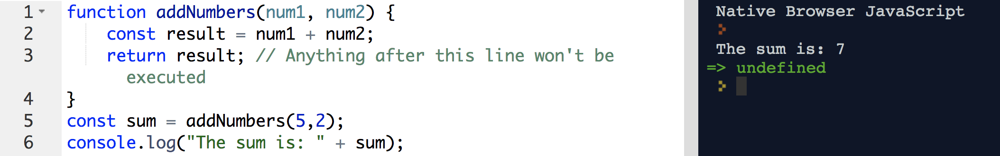
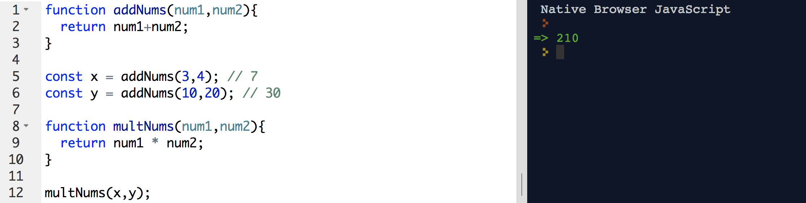

# Return 

## Lesson Objectives
- Discuss the difference between `return` and `console.log`

<hr>

Let's say we have this.

```js
function addNumbers(num1, num2) {
    const result = num1 + num2;
    console.log(result);
}

addNumbers(30,5);
```

This function will take 2 parameters and `console.log()` the variable `result`. 

However, what if I want to use this number later on in my program?  We have to remember that `console.log()` only prints something into the console.  Our `const result` is trapped inside the function.  How can we prove this?  Let's try setting a variable that should equal the result of the executed function.

```js
// addNumbers() is declared in global scope
function addNumbers(num1, num2) {
		// variable 'result' is defined within local scope
    const result = num1 + num2;
    console.log("The sum is: " + result);
}
// we are setting this variable 'sum' to be the result of addNumbers(5,2)
const sum = addNumbers(5,2);
console.log("The sum is: "  + sum);
```



Notice how the `console.log()` prints the result.  When we try to `console.log()` the sum, it is undefined.   

<hr><hr>

The `return` keyword returns a value to whoever calls the function (and exits the function):


```js
function addNumbers(num1, num2) {
    const result = num1 + num2;
    return result; // Anything after this line won't be executed
}

const sum = addNumbers(5,2);
console.log("The sum is: " + sum);
```



<hr>

Let's explain this in more detail, focusing more on the `return`.

```js
const plus = function(a,b){
  return a + b;
};
console.log(plus(1,2));
```

Here, we:
1. Declare the variable `plus`
2. Assign it a function with two parameters, a and b
3. We are `console.log()`-ing the result of this function.

<hr>

When evaluating a function invocation expression, the instruction pointer jumps to the top of the function body and sequentially executes every statement within the function body until there are no more statements left to execute (in which case the function returns undefined), or it hits a return statement.

Thus, the steps the computer is reading this function is...

```js
const plus = function(a,b){
  return a + b; // Step 2 (running this statement of a+b)
};
plus(1,2); // Step 1 (execute function)
```

If the instruction pointer hits a `return` statement, it pops out of
the function body immediately, returning the expression after the
return keyword.  In the above example, we are `return`-ing the statement `a+b` back into the Global scope.

In the case of our function `plus`, for example, we return the value
that the expression `a+b` evaluates to; in the case of `plus(3,4)`,
`a` is bound to `3` and `b` to `4` within the body of the function, so the `return` is `3+4`, i.e `7`. 

Like all expressions, function invocation can be nested:

Ex. 1: Expressions
```js
const plus = function(a,b){
  return a + b; // Step 2 (running this statement of a+b)
};
const bigSum = plus(3,4) + plus(5,7);
console.log(bigSum); // 19
```

Ex. 2: Functions inside function calls:
```js
const plus = function(a,b){
  return a + b; // Step 2 (running this statement of a+b)
};
plus(plus(1,2),plus(3,4)); // 10
```

For Ex 2. 

```js
plus(plus(1,2),plus(3,4)); // 10
```

If we break it down...

`plus(a,b);`

The result of `plus(1,2)` = `a`
The result of `plus(3,4)` = `b`

-----

We can chain these together.

```js
function addNums(num1,num2){
  return num1+num2;
}

const x = addNums(3,4); // 7
const y = addNums(10,20); // 30

function multNums(num1,num2){
  return num1 * num2;
}

multNums(x,y); // 210
```



We are going to be using these `return` statements from now until the end of time.  We will get more reps with this throughout.  These statements are prevalent throughout JS, and you're going to see just how important they are.

<hr>

I want you to try to figure out what's happening in this function.

```js
function areBothEven(num1,num2){
  if(num1 % 2 === 0 && num2 % 2 === 0){
    return true;
  } else {
    return false;
  }
}
console.log(areBothEven(1,2));
console.log(areBothEven(2,2));
console.log(areBothEven(4,8));
console.log(areBothEven(100,77));
```

Note: The `%` operator is called 'modulus'.  It is checking for a remainder.

`10 % 2 = 0` ==> `10/2 = 5, remainder 0`

`5 % 2 = 1` ==> `5/2 = 2.5, remainder 1, because 4/2 and 6/2 have remainder 0`

`11 % 3 = 2` ==> `11/3 = 3.667, remainder 2, because 9/3 and 12/3 have remainder 0`

<hr>

I want you to write me a function `areBothOdd()` that checks to see if both numbers are, indeed, odd.

## Examples

Fix this code.

```js
function sayYourName(name){
	const addPhrase = name  " is a lunatic";
	console.log(addPhrase);
}
const phrase = sayYourName("Kat");
alert(phrase " and is great");
```


