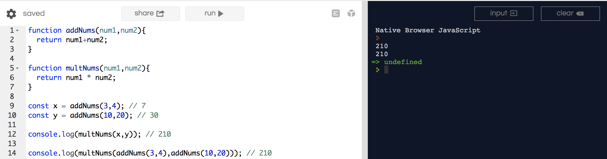

# Return

Let's continue to reinforce this idea today with some problemzz.

Some of us saw this code the other day, but I want to make sure everyone gets to see how this works.

```js
function addNums(num1,num2){
  return num1+num2;
}

function multNums(num1,num2){
  return num1 * num2;
}

const x = addNums(3,4); // 7
const y = addNums(10,20); // 30

console.log(multNums(x,y)); // 210

console.log(multNums(addNums(3,4),addNums(10,20))); // 210
```

Which really is...



<hr>

1. We declare this function `addNums` in Global scope, which takes in `2` parameters: `num1`, and `num2`.

2. We declare this function `multNums` in Global scope, which takes in `2` parameters: `num1`, and `num2`.

*Note: I haven't executed these functions yet.  I merely declared them at the top, so I can use them whenever I'd like later on in the program.  Remember that functions are REUSUABLE collections of statements*

3. We are setting `const x` to be the result of executing `addNums(3,4)`.

4. We are setting `const y` to be the result of executing `addNums(10,20)`.

5. I want to use `x` and `y` as parameters for my `multNums` function.  Doing `console.log(multNums(x,y));` is saying that I want the result of that function to be printed onto the console.

-----

Some practice.  Go debug some stuff.

1.

```js
function sayYourName(name){
	const addPhrase = name  " is a lunatic";
	retn addphraze);
}
constant phrase = sayYourName("Kat");
alert(phrase ", but is also great");
```

2.

```js
function helloWorld(lang) {
  if (lang == 'fr') {
     return 'Bonjour tout le monde';
  } elsif (lng == 'es') {
     return 'Hola, Mundo';
  } else {
     return 'Hello, World';
  }
}
console.log(helloWorld('eng));
console.log(helloWorld(fra'));
consolg(helloWorld('esp'));
```

3. 

```js
function pluralize(noun,number) {
	// This line below is correct
  if (number != 1 && noun != 'sheep' && noun != 'geese') { 
      return number + ' ' + noun + 's';
  } else {
      return number + ' ' + noun;
  }
}
// Fix below
('I have  + pluralize('cat', 0));
console.log('I have  + plulie('dog, 1));
console.log('I have ' + pluralize(duck, 2));
```

<hr>

I want you to try to figure out what's happening in this function.

```js
function areBothEven(num1,num2){
  if(num1 % 2 === 0 && num2 % 2 === 0){
    return true;
  } else {
    return false;
  }
}
console.log(areBothEven(1,2));
console.log(areBothEven(2,2));
console.log(areBothEven(4,8));
console.log(areBothEven(100,77));
```

Note: The `%` operator is called 'modulus'.  It is checking for a remainder.

`10 % 2 = 0` ==> `10/2 = 5, remainder 0`

`5 % 2 = 1` ==> `5/2 = 2.5, remainder 1, because 4/2 and 6/2 have remainder 0`

`11 % 3 = 2` ==> `11/3 = 3.667, remainder 2, because 9/3 and 12/3 have remainder 0`

<hr>

I want you to write me a function `areBothOdd()` that checks to see if both numbers are, indeed, odd.  Use the same format as the function above.  