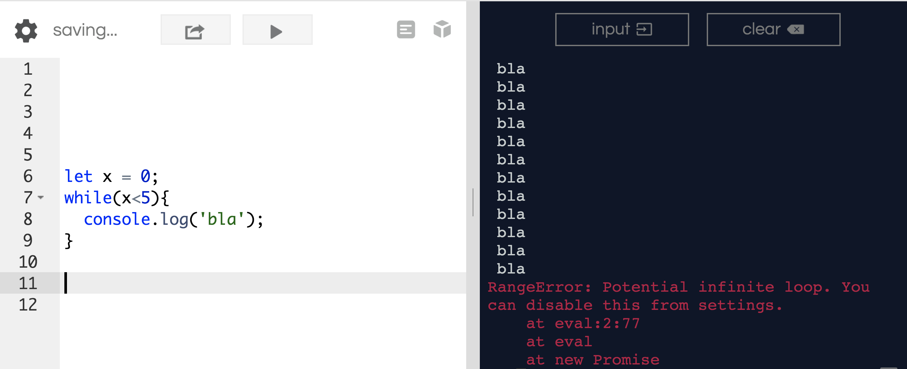
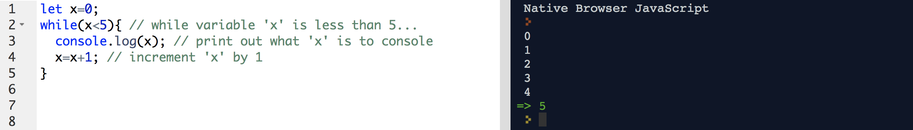
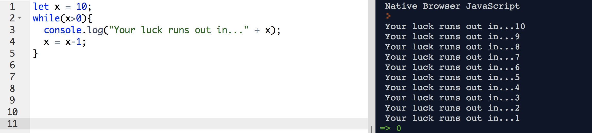
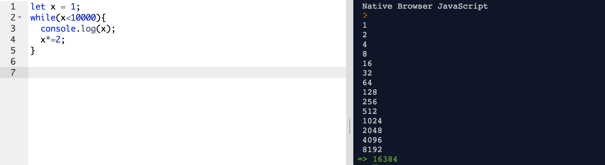
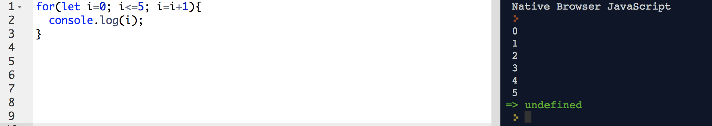
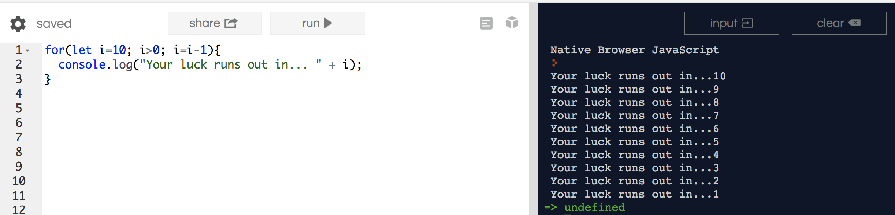
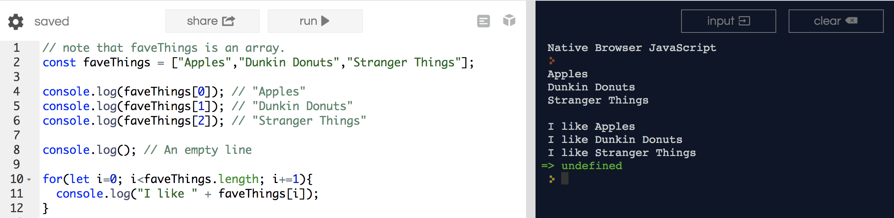
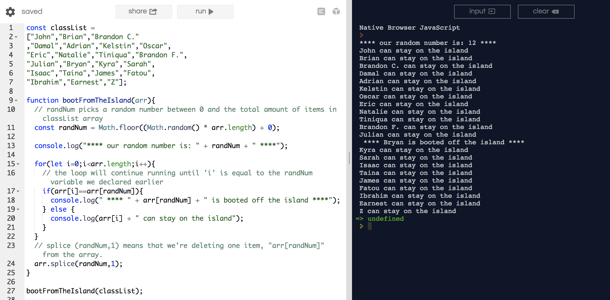
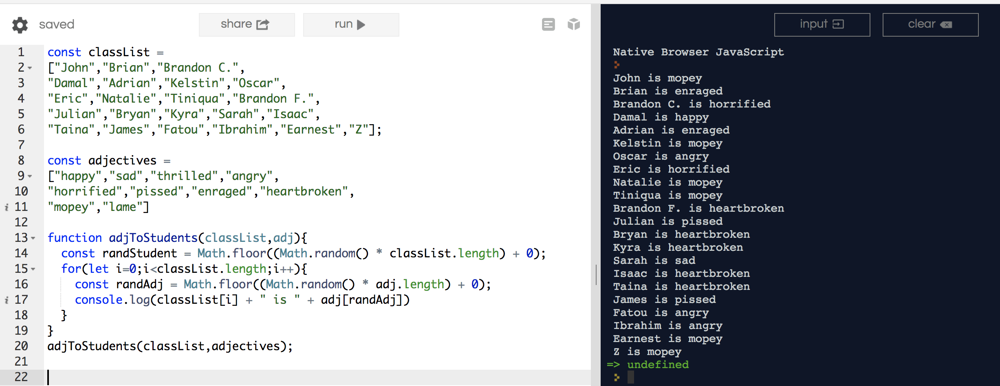

# Loops

### Lesson Objectives
- Discuss what loops actually are
- Talk about the difference between `while` and `for`

### Forewarning

I don't expect you to fully understand what's going on.  Just keep an open mind and attempt to get the logic behind loops.  We'll practice the syntax for this and all things JS during the next couple of weeks.

## Loops!

“A loop is a sequence of instructions that is continually repeated until a certain condition is reached. ”
- Our dear friend Google


There are various types of loops we are going to talk about.  

### `while`

The `while` loop basically tells JavaScript to repeat a condition while the statement is true.

```js
while(expression){
	// do something
}
```

ex. 1.  Actually write this one out in repl.  You can copy/paste the other ones.

```js
let x = 0;
while(x<5){
  console.log('bla');
}
```



Okay, what's the deal?

In this statement, `x<5` is always going to be valid.  

Why?

If our initial variable, `x` is 0, `x` is always going to be less than `5`.  We need to increment our variable by some value if we want our loop to end.


ex. 2.  Just add to what we've written already in repl.
```js
let x=0;
while(x<5){ // while variable 'x' is less than 5...
	console.log(x); // print out what 'x' is to console
	x=x+1; // increment old 'x' by 1
}
```



So you see that the statement is repeating up until `x=5`.  Because 5 is not `less than` 5, the loop stops running because the expression is no longer valid.

ex. 3
```js
let x = 10;
while(x>0){
	console.log("Your luck runs out in..." + x);
	x = x-1;
}
```



The major thing that's happening here is the `x = x-1` expression.  At the very beginning, before the loop takes place, `x = 10`.  After one iteration of the loop, `x = 9`, because `10-1 = 9`.  After the second iteration of the loop, `x = 8`, because `9-1 = 8`.  This repeats, so on and so forth, until the condition `x>0` is no longer met.

ex. 4
```js
let x = 1;
while(x<10000){
	x*=2;
	console.log(x);
}
```



Whoa, what is `x*=2`??????

`x*=2` = `x = x*2`

So in reality, this loop looks like...

```js
let x = 1;
while(x<10000){
	x = x*2;
	console.log(x);
}
```

It's just easier to write `x*=2`.  

### `for`

The other type of loop we use is called a `for` loop.

The for loop is another way of repeating statements, more specialized than while:

```
for (initializer; condition; iterator) {
  // do something
}
```

ex. 1 (Try writing this one out)
```js
for(let i=0; i<=5; i=i+1){
	console.log(i);
}
```

`for` loops create its own scope.  

`let i=0` is the initial variable "counter" for the loop.
`i<=5` is the condition being set.
`i=i+1` means that we are increasing the "counter" by 1.



ex. 2

```js
for(let i=10; i>0; i=i-1){
	console.log("Your luck runs out in... " + i);
}
```



Note how 

```js
for(let i=10; i>0; i=i-1){
	console.log("Your luck runs out in... " + i);
}
```

and 

```js
let i = 10;
while(i>0){
	console.log("Your luck runs out in..." + x);
	i = i-1;
}
```

do the same exact thing.  Only one is easier to write than the other.

ex. 3

```js
// note that faveThings is an array.
const faveThings = ["Apples","Dunkin Donuts","Stranger Things"];

console.log(faveThings[0]); // "Apples"
console.log(faveThings[1]); // "Dunkin Donuts"
console.log(faveThings[2]); // "Stranger Things"

console.log(); // An empty line

for(let i=0; i<faveThings.length; i+=1){
	console.log("I like " + faveThings[i]);
} 
```



In the `for` loop, remember that `i` is iterating between the initial value, and the conditional value.  If `faveThings.length = 3`, because there are 3 items in the array, the loop really looks like...

```js
for(let i=0; i<3; i+=1){
	console.log("I like " + faveThings[i]);
} 
```

...which is really telling us this.

```js
	console.log("I like " + faveThings[0]); // i=0
	console.log("I like " + faveThings[1]); // i=1
	console.log("I like " + faveThings[2]); // i=2 
```

...and then it stops, because the condition says `i<3`, not `i<=3`.

<hr>

### "Realer" implementation of `for` loops

ex. 1
```js
const classList = 
["John","Brian","Brandon C."
,"Damal","Adrian","Kelstin","Oscar",
"Eric","Natalie","Tiniqua","Brandon F.",
"Julian","Bryan","Kyra","Sarah",
"Isaac","Taina","James","Fatou",
"Ibrahim","Earnest","Z"];

function bootFromTheIsland(arr){
  // randNum picks a random number between 0 and the total amount of items in classList array
  const randNum = Math.floor((Math.random() * arr.length) + 0);
  
  console.log("**** our random number is: " + randNum + " ****"); 
  
  for(let i=0;i<arr.length;i++){
    // the loop will continue running until 'i' is equal to the randNum variable we declared earlier
    if(arr[i]==arr[randNum]){ 
      console.log(" **** " + arr[randNum] + " is booted off the island ****");
    } else {
      console.log(arr[i] + " can stay on the island");
    }
  }
  // splice (randNum,1) means that we're deleting one item, "arr[randNum]" from the array.
  arr.splice(randNum,1);
}

bootFromTheIsland(classList);
```



ex. 2: Adjectives
```js
const classList = 
["John","Brian","Brandon C.",
"Damal","Adrian","Kelstin","Oscar",
"Eric","Natalie","Tiniqua","Brandon F.",
"Julian","Bryan","Kyra","Sarah","Isaac",
"Taina","James","Fatou","Ibrahim","Earnest","Z"];

const adjectives = 
["happy","sad","thrilled","angry",
"horrified","pissed","enraged","heartbroken",
"mopey","lame"] 

function adjToStudents(classList,adj){
  const randStudent = Math.floor((Math.random() * classList.length) + 0);
  for(let i=0;i<classList.length;i++){
    const randAdj = Math.floor((Math.random() * adj.length) + 0);
    console.log(classList[i] + " is " + adj[randAdj])
  }
}
adjToStudents(classList,adjectives);
```

