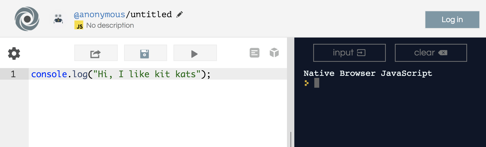
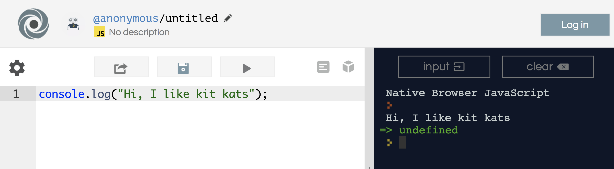
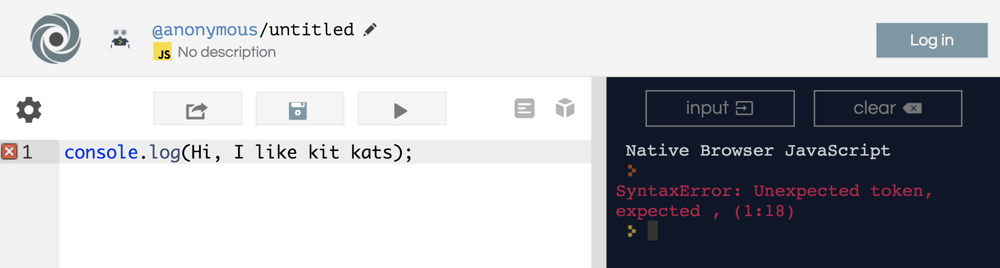

## Introduction to JavaScript

<h1><a href="http://bit.ly/2lEuege">http://bit.ly/2lEuege</a></h1>

### Lesson Objectives
- Discuss what JS is/does
- Attempt some simple JS commands

### Intro

“When you watch a movie, there is a lot that goes on behind the scenes. The actors are like HTML, they are the stars of the movie. Then you have all the designers who create the sets and costumes - their role is to style the cast, the set, etc. CSS is like the designers in that they style a website. Behind the scenes though, you have editors, camera-people, sound-people, and many more. Those people are like JavaScript, they add a lot to the movie, but you don’t actually see them.”

Let's look at this website here, for example.  Do you know "The Jungle Book"?

<a href="http://thelawofthejungle.com/">Jungle Book!</a>

Look at all the things going on in this website.  Can you see what is HTML, CSS?  Where do you think JavaScript is being used?

#### Libraries

In JavaScript, we can use libraries. Libraries are pre-written code that we can use to create projects. We need to learn the basics before we are able to use these libraries. The basics are the building blocks that will teach us how best to use the libraries. For example, if you don’t know how to cook, and someone gives you a ton of ingredients and tells you to bake a cake, it would be very difficult to do so. Libraries are like all of those ingredients - they are tools you can use to build a website; we just have to know how to use them.

Examples of JS Libraries: <br>

<h3><a href="http://paperjs.org/">PaperJS</a></h3>
<h3><a href="https://threejs.org/examples/#webgl_camera_cinematic">ThreeJS</a></h3>

We... won't see these for a while.  I just want you guys to know they exist.  Play around with them for a little - it's fun.

### JS Facts

JavaScript = Language of the Interweb

<a href="https://en.wikipedia.org/wiki/JavaScript#Uses_outside_Web_pages">List of web things you know that utilize JS</a>

#### What can JS do?

<ul>
	<li>Image switchers (think images.google.com)</li>
	<li>Full featured web apps</li>
	<li>Can keep track of individual users via cookies</li>
	<li>Interactive things i.e. sliders, tabs, buttons...</li>
	<li>Drawing + Animation</li>
	<li>Advertisements</li>
	<li>Facebook</li>
</ul>

Basically, JS is what allows websites to do cool things.  The varying degrees of coolness among sites is totally dependent on however much work that person is willing to put into their site.

### Interlude

<h1><a href="https://repl.it/languages/javascript" target="_blank">repl.it</a></h1>

This website is called REPL.  If you remember what codepen.io was like, repl does the exact same thing.  This is a JavaScript simulator - it'll execute code without actually affecting your local machine.  It's a powerful tool.

### Print Statements

The most basic statement in JS is called the print statement.  This literally spits out into the JS console whatever you want it to.  There are caveats to this, but let's start to try this together.

```js
console.log("Hi, I like kit kats");
```

Type that statement into repl, then press run.  Should look something like...



Click "run", and watch the console...



Take note regarding how there are quotes around "Hi, I like kit kats."  What happens if I try to run the same `console.log` without the quotes?

```js
console.log(Hi, I like kit kats);
```



Get ready, folks!  Introduce yourself to your new worst enemy - syntax errors.  These essentially are errors caused by 'syntax', or commonly known as 'spelling'.  JS is an excessively unforgiving language.  

The reason there's an error is that if you type the statement without quotes, JavaScript thinks you're trying to print out the contents housed within a "VARIABLE".  That's something we'll go over a different day.