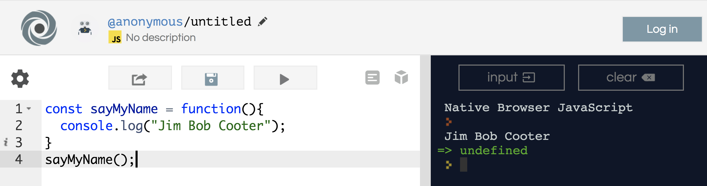
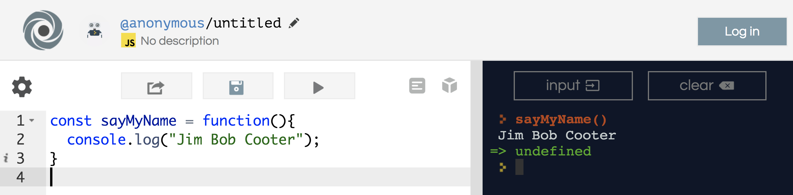
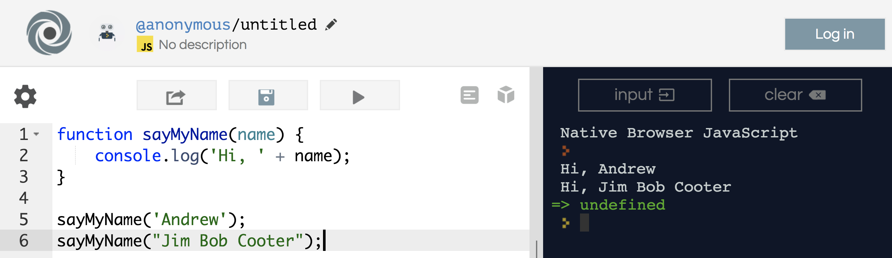
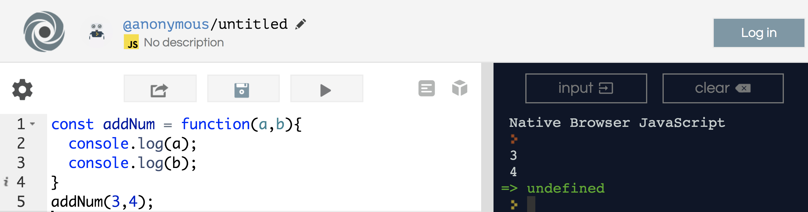
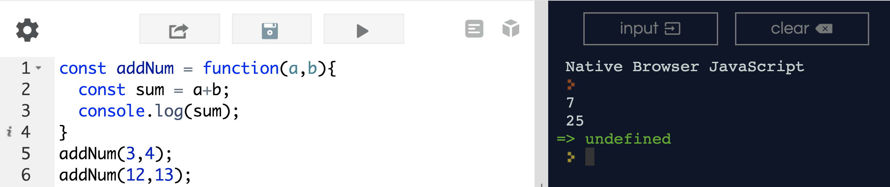
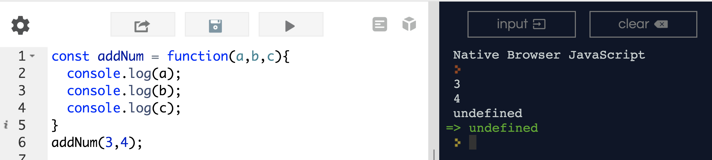
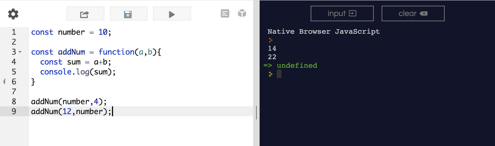

## Functions 

<h1><a href="http://bit.ly/2zu9F9r">http://bit.ly/2zu9F9r</a></h1>

### Lesson Objectives
- Discuss what functions are
- Write a few functions and execute them.

### DO NOW

<h1><a href="https://repl.it/languages/javascript" target="_blank">repl.it</a></h1>

In repl, I want you to write an expression.

Write 3 variables...

```js
const a
const b
const c
```

Set each of these variables to equal 3 different numbers.

e.g.

```js
const a = 10;
```

Write me a `const answer = ` that adds the first two numbers, then divides that by the third number.  Output `answer` to the console via a `console.log`.

<hr>

### Functions

A function is a reusable collection of statements.

```js
const sayMyName = function(){
	console.log("Jim Bob Cooter");
}
```

Inside of this variable, `sayMyName`, we are storing a function.  This function, when executed, will spit out a `console.log("Jim Bob Cooter");`.  How do we execute this function?  

```js
sayMyName();
```

There are two main ways to execute this function.

#### First Way



We write `sayMyName()` in the code itself.

#### Second Way



We write `sayMyName()` in the console.

- Both of these methods have their own merits.  If you want the function to execute in the flow of the program, write it inside of the code itself.  

- If you want the user, for some reason, to execute your function, you should write it in the console.  This is also a good way to double check if your function is executing the way you'd want it to.

#### Example

Write a function named `favoriteActivity`, where when you execute it, it prints out a `console.log()` that states your favorite activity!

<hr>

### Circular Dependencies

Who wants to tell me about what's happening here?

```js
const chicken = function() {
	egg();
}

const egg = function() {
	chicken();
}

egg();
```

### Anomymous Functions vs Named Functions.

These two functions below...

```js
const x = function(){
	alert(3+4);
}

x();
```

The function above is actually an anonymous function (a function without a name).  This is stored within the variable `x`.


```js
function x(){
	alert(3+4);
}

x();
```

The function above is named `x`.  It is not a variable.

When executed, both of these functions do the same thing.  Functions stored in variables do not need function names. They are always invoked (called) using the variable name.

This is more a personal preference type of deal.  I'd typically prefer to declare variables, but for the purposes of what we're doing in class, use whichever makes more sense to you.

*Hint: `alert()` causes, you guessed it, a pop-up window to appear!*

### Arguments

A function can accept any number of named "arguments", or "parameters".  

It'll just be easier if I show you how this works.

```js
function sayMyName(name) {
    console.log('Hi, ' + name);
}

sayMyName('Andrew');
sayMyName("Jim Bob Cooter");
```



So, what's happening here is.

- We declare a function `sayMyName` that takes in the parameter `name`.

- Inside the function, there is a `console.log` which prints the statement, "Hi, " + the parameter `name`.  

- When we execute the function `sayMyName()`, instead of having a blank (), we are inserting a string `Andrew`.  Within the "scope" of this function, `name` equals `"Andrew"`.  

- Inside the `console.log()`, the statement is really `"Hi, " + "Andrew"`, with the string `"Andrew"` replacing the parameter `name`.

<hr>

We can use arguments to create functions that do arithmetic!

```js
const addNum = function(a,b){

}
```

Just to make sure we understand how arguments and functions are working, let's take this step by step.

```js
const addNum = function(a,b){
	console.log(a);
	console.log(b);
}
addNum(3,4);
```


So you see, when we are executing this function with two parameters `addNum(3,4)`, the function recognizes that the "first number", `a`, is 3.  The function also recognizes that the "second number", `b`, is 4.  

So, let's complete the 'sum' method.

```js
const addNum = function(a,b){
	const sum = a+b;
	console.log(sum);
}

addNum(3,4);
addNum(12,13);
```



*note: you can include as many, or as few parameters as you'd like.  Just be careful of the example below.  You'll see that while `a` and `b` are defined, `c` is not.*



You can also pass variables into our function.

```js
const number = 10;

const addNum = function(a,b){
	const sum = a+b;
	console.log(sum);
}

addNum(number,4);
addNum(12,number);
```



#### Examples

- Write me a function that takes in 2 parameters.  I want you to `console.log()` the result if you subtract the first number from the second number.

- Write me a function that takes in 3 parameters.  I want you to `console.log()` the result if you add the first two numbers, and then divide that by the third number.  Note: use PEMDAS!

- Write a function that takes in a parameter `name`.  I want you to print a statement in the console that looks like...

"Hi, `name`, I hear you like Kit Kats".

