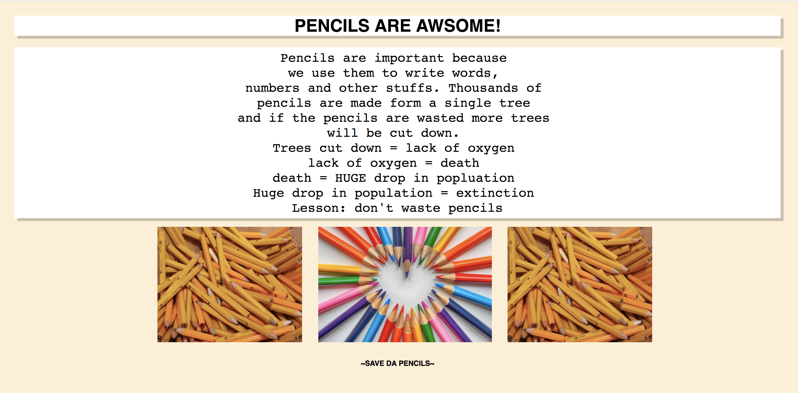
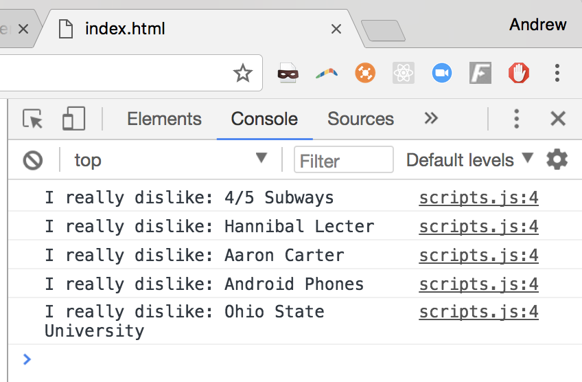
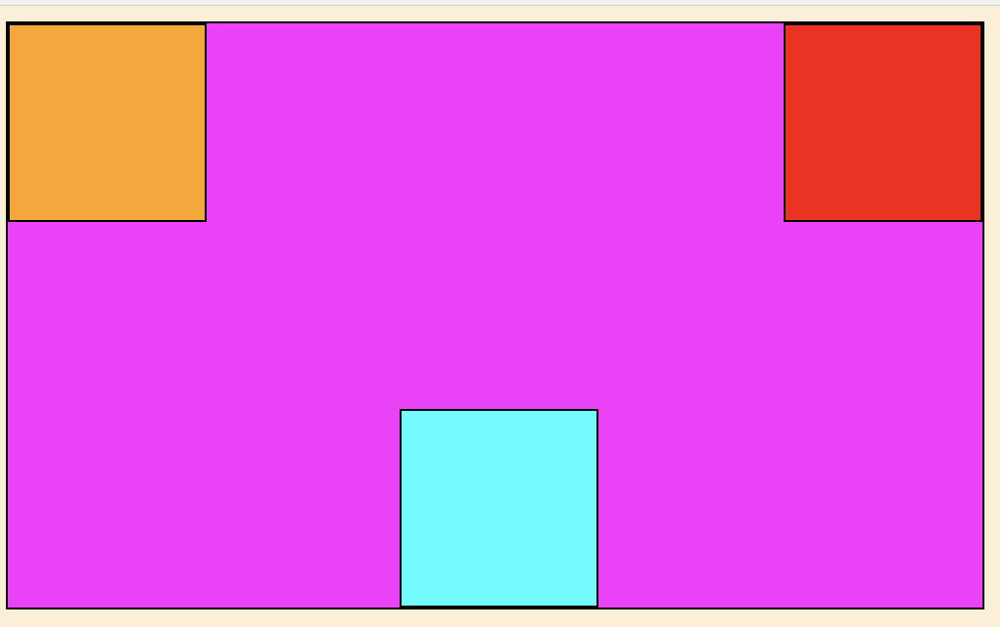

# Day 2/3

Complete 4 of the 6 prompts.  You'll get bonus credit if you complete any additional prompts.  Add your answers to these prompts to the document you worked on yesterday.

Completion of at least one	 visual prompt is mandatory.  Choose either #5 or #8.  

## 5. (HTML/CSS)

Create a stylized page about a simple product (i.e. a pencil, a baseball, eyeliner, etc...).  Make it decently good.  

Requirements
- HTML/CSS
- A solid description of the product + relevant pictures
- A font chosen from Google fonts
- Colors chosen from the hex wheel
- The page should be aligned to the center of the page

For example, a 7th grader made this...



I fully expect you, at the very minimum, to create something of equal caliber.

## 6. (JS)

### Write this function in repl, then transfer the answer to the submission sheet.

Write me a JS function that...

- Takes in a parameter `name`
- `console.log()`s the following message

"`name` is my best friend, and I love this person to death"

Execute the function using 3 different `name`s.

*Bonus: use `alert()` to exclaim the phrase* <br>
*Bonus 2: use a `prompt()` to grab a `name` the user wants to input*

## 7. (HTML/JS)

Using this array...

```js
const leastFaveThings = ["Cilantro","4/5 Trains","NY Yankees","Aaron Carter","Android Phones"];
```

I want you to do the following.

- Create an HTML/JS file, and attach them together
- `console.log()` the array
- Change the third item in the array to something of your choice
- Add "Manhattan Clam Chowder" to the end of the array using an array method we've learned
- Remove "Cilantro" from the array using an array method we learned
- Use a `for` loop to iterate through the each item of the array, add the string "I really dislike: " before each item, and then `console.log()` the results



*Hint: Use the array and loop lecture notes*


## 8. (HTML/CSS)



Recreate this image using HTML/CSS!

*Hint: You'll need to use positioning!  Reread the lecture!*

## 9 (JS)

### Write these answers directly onto the submission sheet.

#### Part 1. 
Using the provided variable definitions, replace the blanks with a mathematical or boolean operator that evaluates the expression to true. :wave:

[Comparison + Arithmetic Operators](https://www.w3schools.com/jsref/jsref_operators.asp)

Remember:

<ul>
  <li>==</li>
  <li>===</li>
  <li>!=</li>
  <li>!==</li>
  <li>></li>
  <li><</li>
  <li>>=</li>
  <li><=</li>
</ul>

```js
  const a = 4;
  const b = 53;
  const c = 57;
  const d = 16;
  const e = 'Jim Bob Cooter';
```

-  a _ b;
-  c _ d;
-  'Name' ___ 'Name';
-  a _ b ___ c;
-  a _ a ___ d;
-  e ___ 'Jim Bob Cooter';
-  48 ___ '48';


#### Part 2. 

Using the Or `||`, And `&&`, and Not `!`

```js
   const bump = true;
   const grind = true;
```

Using the variables `bump` and `grind` write three different expressions that are `true` and three different expressions that evaluate to `false`.

Check this out:
[Mozilla Developer Network Logical Operators](https://developer.mozilla.org/en-US/docs/Web/JavaScript/Reference/Operators/Logical_Operators)


## 10. (JS)

### Write this in repl, then transfer to the submission sheet.

Define a function `reverseString()` that returns the reversal of a string. For example, `reverseString("yankees stink")` should return the string `"knits seeknay"`. 

It should be set up like this...

```js
function reverseString(str){
	console.log(str);
	// bla bla bla code
}
reverseString("yankees stink");
```

*Hint: there is a `.reverse()` method but it only works on arrays. You can `.split('')` a string to turn it into an array, and `.join('')` it back together again into a string.* <br><br>
*Hint 2: you can chain these methods together*

```js
bla.function1().function2().function3()
```

Above means that you're launching `function1()`, then `function2()`, and finally `function3()` in that order, ASSUMING `bla` is an array.
