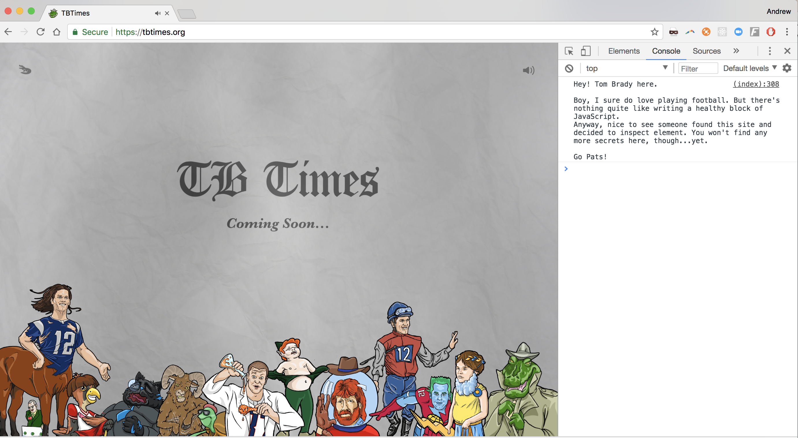
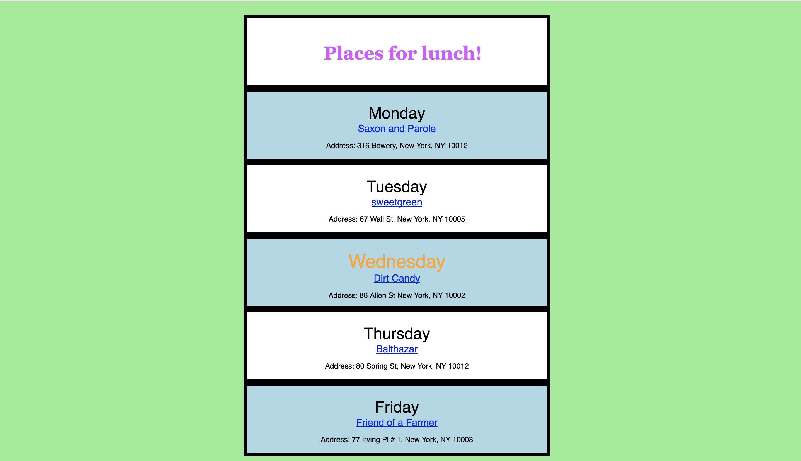

# Day 4

Pick one of two prompts.  You'll get extra credit if you complete both.

8/12 of the total prompts is due Thursday, 12/21.  

## Note of encouragement:

So, today, Tom Brady posted this on the internet.  



If he can write a few blocks of JS (note how he wrote a `console.log()`), you guys can too!  :) 

Let's go.

## 1. (HTML/CSS)

Recreate the image below in HTML/CSS.



*Hint: you should be recycling `<div>` tags!*


## 2. (JS)

Complete the following questions!

### Q1: Your top choices

Create an array such as... 

```js
const myFaveThings = [];
```

Populate the array with 4 items of your choice.

#### Step 1: 

- For each choice, use a `for` loop to log to the screen a string like: `"My #1 favorite thing is Run-D.M.C."`...

#### Step 2:

- Change it to log `"My 1st favorite is`, `"My 2nd favorite"`, `"My 3rd favorite"`, picking the right suffix for the number based on what it is.


### Q2: Guessing Game

- Store a random number from 1-100 in a variable. This will be the "secret" number that the user needs to guess.  

*Hint: You might need to use a `Math.random()` function.  Google how to do it*

- Use `prompt()` to ask the user to guess a number between 1-100.
- If the user guesses right, tell them they win!
- If the user guesses a number that is greater than the secret number, tell them "Too high, try again."
- If the user guesses a number that is less than the secret number, tell them "Too low, try again."

Bonus: Keep track of the number of guesses it took the user to guess the right number. When they win, tell them how many guesses they took.