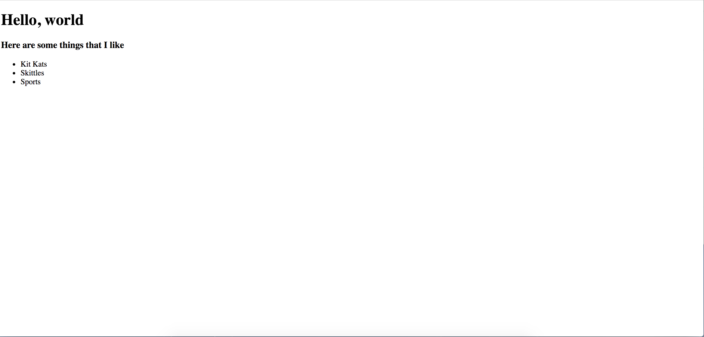

# T2 Final

## Part 1: Multiple Choice.

1) What is the HTML shortcut we type into Sublime before pressing `tab`?

a) `htm` <br>
b) `<htm` <br>
c) `<html>` <br>
d) `html` <br>

2) What is not a valid 'color' format in CSS?

a) hex wheel <br>
b) color name <br>
c) palette number <br>
d) rgb <br>

3) Based on this code sample...

```html
<h1>Hello, chap</h1.><p>I think bananas are great</p>
```

Why won't this code run?

a) The `<p>` needs to be capitalized <br>
b) The `<h1>` and `<p>` are on the same line <br>
c) There is a `.` within the closing `<h1>` tag <br>

4) What is the proper way of writing a console log in JS?

a) `consolelog(hello)` <br>
b) `console.log(hello)` <br>
c) `console.log("hello");` <br>
d) `console.log("hello")` <br>

5) Which of the following tag is used to mark a begining of paragraph ?

a) `<td>` <br>
b) `<br>` <br>
c) `<p>` <br>
d) `<tr>` <br>

6) The tag to create a numbered list is...

a) `<li>` <br>
b) `<ol>` <br>
c) `<ul>` <br>
d) none of the above <br>

### This function below is for Questions 7-9

```js
function nameCreator(name){
	console.log(name + "is cool");
}
```

7) In the above function, what is `name`?

a) an argument <br>
b) literally a `name` <br>
c) a pass <br>

8) How would I execute this function?

a) `namecreator(name)` <br>
b) `nameCreator(Mr. DeBottis);` <br>
c) `nameCreator("Mr. DeBottis");` <br>

9) If I executed this function correctly, what would it say in the `console.log()`?

a) `Syntax Error` <br>
b) `"Mr. DeBottis is cool";` <br>
c) `"Mr. DeBottisis cool"` <br>
d) `"Mr. DeBottisis cool";` <br>

10) In Bootstrap's grid system, how many units wide is each container?

a) 8 <br>
b) 10 <br>
c) 12 <br>
d) 14 <br>

11) An array is housed within...

a) {} <br>
b) () <br>
c) [] <br>
d) <> <br>

12) Which one of these styles would be the best way to center the text on the webpage?

a) `align-text: center` <br>
b) `align-text: center;` <br>
c) `align: center` <br>
d) `text-align: center;` <br>

13) Which one is NOT a valid statement?

a) 12 == 12 <br>
b) 13 != 12 <br>
c) 13 && 13 != 14 <br>
d) 12 % 12 = 12 <br>

### This function below is for Questions 14-16

```js
function compareNum(num1,num2){
	if(num1 < num2){
		alert(num1 + " is less than " + num2);
	} else if(num1 > num2){
		alert(num1 + " is greater than " + num2);
	}
}
```

14) Which is the correct way to execute this function?

a) `comparNum(num1,num2)` <br>
b) `compareNum("3","4")` <br>
c) `compareNum(3,"4")` <br>
d) `compareNum(3,4);` <br>

15) Using your response from Q. 14, what would be the output from this function?

a) `num1 is less than num2` <br>
b) `3 is less than 4` <br>
c) `3 is greater than 4` <br>
d) `syntax Error: undefined` <br>

16) Is there anything potentially missing from this function?

a) You could use an `else` statement in case `num1 = num2` <br>
b) You need another `else if` statement in case `num1 = num2` <br>
c) Nope <br>

## Part 2: Open Response

1)  Write me a function that takes in a parameter `name` and prints...

`"Hello, " + name + " I am better than you at being cool."`


```


```

2) Replicate the below image using HTML.




```html
<!DOCTYPE html>
<html>
<head>
	<link rel="stylesheet" type="text/css" href="styles.css">
</head>
<body>


</body>
</html>
```

3) 
