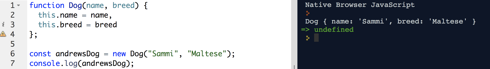

# Objects (II)

### Lesson Objectives:
- Introduce constructor functions
- Discuss object methods

### Do Now

Create an object housed within the variable `myCar`, and add the following keys.

- `make`
- `model`
- `year`

Fill in the values with information of your choice.

A sample object, as a refresher...

```js
const andr = {
	name: "Andrew",
	age: 27,
	cool: true
}
```

*Hint: there is no comma inserted after the last key/value pair*

### Creating New Objects

There are four types of ways to create new objects...

##### Object Constructor

Okay, so basically, JS uses something called prototypal inheritance. Refresh a browser without any JS and run the following...

```js
console.log(Object);
console.log(Array);
```

Notice 2 things...
- The capitalization
- We didn't create anything but these objects exist.

What gives?

JS comes with the bare minimum of data structures defined within the language itself. Ever notice we never have to define what an array is or what a string is?  Or number?

That's because JS comes with these "free" data structures out the box.

Cool beans!  So when we create an array, or when we create a string, what JS is actually doing is taking the base Classes of data types, and making a copy of it. The terms Model/Classes and constructors are basically refering to blueprints.

Blueprints aren't buildings. They are an actual tangible thing that tells you the details on how to build a building.

How does this info relate to object constructors?

```js
const sampleObject = new Object()
```

I just used the Class for `Object` (the initial Object that came free out the box) and used the keyword `new` to replicate a new version of the class. Therefore, we got a new object.

If this is confusing, it's cool. We'll pass this again and often.

##### Object Literal Syntax AKA Object Initializer

```js
const myDog = {};
```

I've just created a brand new blank object using object literal notation and set it to a variable called myDog.  You can populate it with information later on in the program, if you'd wish.

*Remember, use `const` when creating a new variable for the first time*

##### Constructor Function

Constructors are SUPER Important and we'll most likely have to cover this topic again.

- The constructor function is used in conjunction with the keyword `new` to instantiate new objects of a specified type.
	- Think of it as a blueprint.
	- You can use the keyword `new` to instantiate (create an instance, kinda like how in Star trek they materialize new food out of thin air) of the specified constructor.
- The constructor is a function
- The name of the constructor function should always start with a Capital Letter.

```js
// blueprint for dogs
function Dog(name, breed) {
	this.name = name,
	this.breed = breed
};

// a singular dog
const andrewsDog = new Dog("Sammi", "Maltese");
console.log(andrewsDog);
```



### Exercise:

1. Create 2 new dogs.
2. After you've created your dogs, add an age key to ONLY the first one.  Dot notation, remember?

```js
const andr = {
	name: "Andrew"
}
andr.age = 27;
console.log(andr);
```

3. Add a `favoriteFood` key to your second one.

RECAP:
- The constructor is a blueprint. You use it create instances of new objects of that blueprint.
- `this` this is a keyword that we will teach again. It basically refers to the current scope and context of where that code is being executed in runtime.
- `new` this is a keyword used along with constructor functions to create new instances modelled off the blueprint.

---

### Object Methods
As we've said before, the value of a property can be anything in JavaScript, means we can also attach functions to objects properties. When a function is attached to a property, this function becomes a method. Methods are defined the exact same way as a function, except that they have to be defined as the property of an object.

```javascript
const myCar = {
	model: "TL",
	make: "Acura",
	color: "Silver",
	vroom: function() {
		alert('VROOM VROOM!');
	}
};

console.log(myCar);
myCar.vroom();
```

### Iterating over keys of an object
Let's create a function that can iterate over an object's keys.

Let's start by creating an object with a bunch of attributes...

```js
const andrewsDog = {
	name: "Sammi",
	nickname1: "Betch",
	nickname2: "Doge",
	favoriteFood: "Ham",
	favoriteToys: "Hand puppets",
	breed: "Maltese",
	age: 16
};
```

Below is how we can iterate through each key.

```js
const showMeKeys = function(object) {
	for(let i in object) {
		console.log(i);
	}
}

showMeKeys(andrewsDog);
```

##### Exercise
- Create a function called `showMeValues` that takes an object as a parameter.
- It should iterate through all the attributes in the object and console.log all the values.
- Invoke your `showMeValues` with `andrewsDog` to test that it works!

### Resources:
[MDN JS Objects](https://developer.mozilla.org/en-US/docs/Web/JavaScript/Reference/Global_Objects/Object)

[Working with Objects](https://developer.mozilla.org/en-US/docs/Web/JavaScript/Guide/Working_with_Objects)