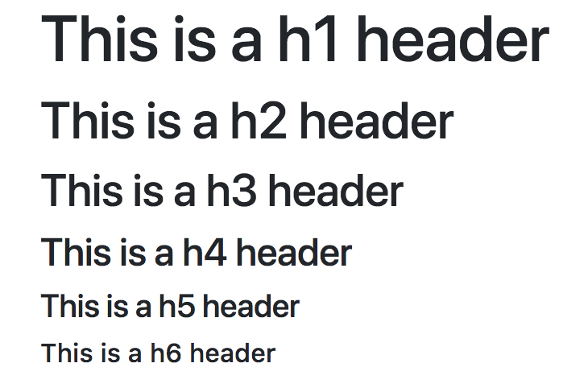
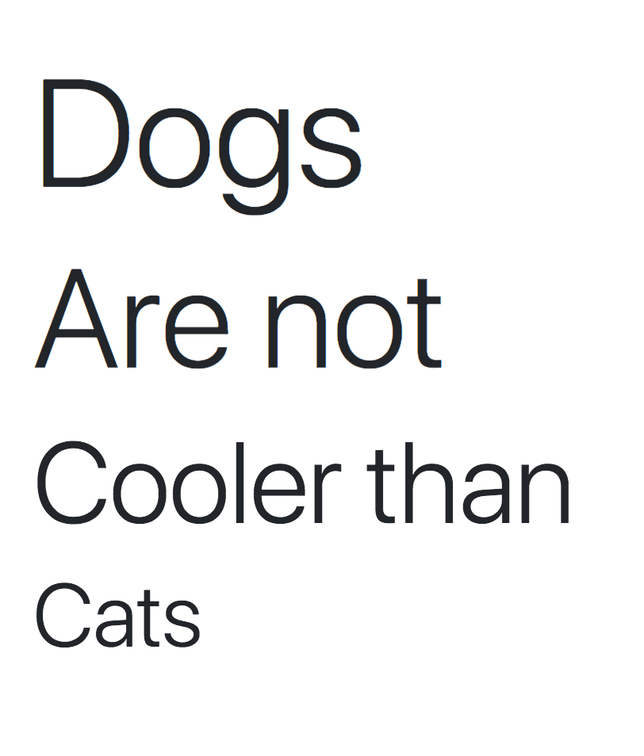
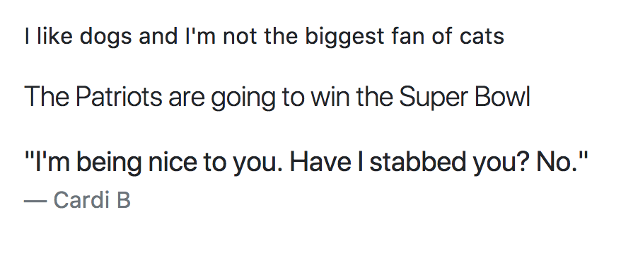

# Intro to Bootstrap

### Lesson Objectives
- Introduce Bootstrap
- Demo some of the things that can be done via BS

## Ok, what is Bootstrap?

Bootstrap is the most popular HTML, CSS, and JS framework for developing responsive, mobile first projects on the web!  

Not a good enough explanation?


Notice how differently the site above looks versus the types of things we've been making in this class so far.  Utilizing this framework will allow you to create highly responsive webpages using minimal amounts of JS.

## Let's get started.

```html
<!DOCTYPE html>
<head>
	<!-- All your meta links go below -->
	<meta name="viewport" content="width=device-width, initial-scale=1">
	<link rel="stylesheet" href="https://maxcdn.bootstrapcdn.com/bootstrap/4.0.0/css/bootstrap.min.css" integrity="sha384-Gn5384xqQ1aoWXA+058RXPxPg6fy4IWvTNh0E263XmFcJlSAwiGgFAW/dAiS6JXm" crossorigin="anonymous">
	<link rel="stylesheet" type="text/css" href="styles.css">
</head>
<body>

	<!-- All your script links go below -->
	<script src="https://code.jquery.com/jquery-3.2.1.slim.min.js" integrity="sha384-KJ3o2DKtIkvYIK3UENzmM7KCkRr/rE9/Qpg6aAZGJwFDMVNA/GpGFF93hXpG5KkN" crossorigin="anonymous"></script>
	<script src="https://cdnjs.cloudflare.com/ajax/libs/popper.js/1.12.9/umd/popper.min.js" integrity="sha384-ApNbgh9B+Y1QKtv3Rn7W3mgPxhU9K/ScQsAP7hUibX39j7fakFPskvXusvfa0b4Q" crossorigin="anonymous"></script>
	<script src="https://maxcdn.bootstrapcdn.com/bootstrap/4.0.0/js/bootstrap.min.js" integrity="sha384-JZR6Spejh4U02d8jOt6vLEHfe/JQGiRRSQQxSfFWpi1MquVdAyjUar5+76PVCmYl" crossorigin="anonymous"></script>
	<script type="text/javascript" src="scripts.js"></script>
</body>
</html>                            
```

You *may* want to copy the above code and paste it into a HTML document on your Desktop.  If you do this and name it something like "template.html", that'd probably be incredibly useful.  You could then copy/paste this template into every new project we create.

## Intro to BS

### I. Headers

Try writing `<h1>` through `<h6>` in the body.

Notice how everything's a bit different now.



With Bootstrap, you can make EVEN BIGGER headers!

```html
  <h1 class="display-1">Dogs</h1>
  <h1 class="display-2">Are not</h1>
  <h1 class="display-3">Cooler than</h1>
  <h1 class="display-4">Cats</h1>
```

Take note of how each of these `<h1>` have different classes.  Also notice how in our own personal CSS page, we never defined these classes.  The reason this works is because these classes are defined in the Bootstrap CSS link we've provided.  If we want to fully utilize this Bootstrap framework, we're going to have to learn and research all the different types of classes there are.



### II. Paragraphs

How do we take normal, "boring" paragraphs, and make them more dynamic?

Look at these different types of text.

```html
  <p>I like dogs and I'm not the biggest fan of cats</p>
  <p class="lead">The Patriots are going to win the Super Bowl</p>

  <blockquote class="blockquote">
    <p class="mb-0">"I'm being nice to you.  Have I stabbed you?  No."</p>
    <footer class="blockquote-footer">Cardi B</footer>
  </blockquote>
```

Notice that there are all these new tags?  Thank Bootstrap for that.  All 3 of these statements are different from one another.



### Practice

- Include a `<h1>` that is your name
- Include a header using the class `display-2`.  Write what your favorite snack is.
- Include a `<blockquote>`.  Write your senior quote in that.


### More Typography stuff...

<a href="https://www.w3schools.com/bootstrap4/bootstrap_typography.asp">https://www.w3schools.com/bootstrap4/bootstrap_typography.asp</a>